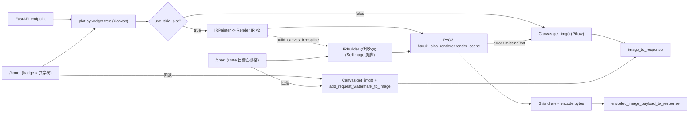

# Rust + Skia Render IR 迁移记录

本文档记录 Haruki Drawing API 将 Pillow 绘制热点逐步迁移到 Rust + Skia renderer 的目标、决策和进度。

> **本文按批次追加，含大量历史执行记录。带日期的小节与「验收记录」是当时的快照，不代表今天的代码。**
> 当前状态以下面的「当前状态」小节为准；剩余工作见 [`skia-migration-todo.md`](./skia-migration-todo.md)，
> Pillow / Skia 的逐功能能力差距见 [`skia-pillow-coverage-gaps.md`](./skia-pillow-coverage-gaps.md)。

## 当前状态

- **迁移已全量完成**：`scripts/skia_parity_sweep.py` 的 63 个真实 payload 用例为 **63 ok / 0 failed**，
  没有 pillow-only 端点（honor 是最后一个，已迁移）。
- **门控只剩一个**：`settings.use_skia_plot`，**默认 `true`**。历史上的 `use_skia_card_box` /
  `use_skia_card_list` / `skia_card_list_fallback_to_pillow` 均已删除。扩展缺失、IR 校验失败或渲染
  失败时 fail-open 回退 Pillow 并打 ERROR。
- **绝大多数端点已收敛为一棵树**：它们用 `src/sekai/base/plot.py` 的 widget 树描述页面；Pillow 走
  `Canvas.get_img()`，Skia 走 `IRPainter` 发 IR v2 → Rust `render_scene` 解释器。card/list 与 card/box 的
  **专用 scene builder 已退役**（`card_render.py` 删除，见下文条目 9），两者现在都画 card drawer 的共享
  widget 树。
- **所有布局都只剩一棵树**：honor 的两套布局已结清（见下文条目 12）。`src/sekai/honor/widget.py` 的
  `HonorBadgeBox` 是唯一的 honor 布局，Pillow 与 Skia 都画它；`honor/skia.py` 只剩水印页脚外壳。
- **仍在手写 IR 的只有两处「薄信封」**（`src/sekai/honor/skia.py`、`src/sekai/chart/drawer.py`），
  它们包的都是 **widget 树无法表达的栅格外壳**，而不是第二套布局：
  - **chart**：谱面栅格由 `pjsekai-scores-rs` 产出，IR 只负责把它 + 水印页脚拼起来；Pillow 回退路径
    （`compose_music_chart_image` → `add_request_watermark_to_image`）共用同一批 `get_watermark_render_spec` 度量。
  - **honor**：徽章本体是共享 widget 树（`build_canvas_ir` 把它 lower 成 IR 后 `splice_root_children` 拼进来），
    手写的只有路由在 compose **之后**才加的水印页脚——它把画布自己的底部若干行拉伸成页脚条
    （`SelfImage` 节点，采样已渲染画布），任何 widget 都表达不了。
- **Rust 是纯 IR 解释器**：PyO3 只暴露 `render_scene` / `renderer_cache_stats` / `clear_renderer_caches`。
  `IR_CAPABILITY = 7`（Python 侧 `REQUIRED_NATIVE_IR_CAPABILITY = 7`），旧 wheel 自动 fail-open。
  5→6 是 `Image.blend="src"`（`Painter.paste_src`），6→7 是 `TriangleBg.tris`。数字**四处硬编码**需同步：
  `lib.rs`、`canvas.py`、`quick-check.yml`、`skia-wheels.yml`。
- **观测**：`GET /render-stats`（每端点 skia / cache_hit / fallback / disabled / error 计数 +
  Skia payload cache 统计）、`GET /cache/stats`（含 `skia_payload_cache`）。
- **结果缓存现状**：**只有 honor 还保留 Skia payload cache**（card/box 与 card/list 的整页缓存已于 2026-07-14 删除：两者把墙钟画进页面——`add_request_watermark` 的秒级 `DT:` 页脚，card/list 还按 `request_now()` 判「未上线」——而 key 里只有 request，命中必然发陈旧图；配套的 `record_skia_cache_hit()` 一并删除。见 `f088c41`、`tests/test_asset_signature_cache_key.py::test_card_pages_are_not_cached`）
  misc/alias-list 的整页结果缓存已**主动删除**，profile 则刻意不加整页缓存（只留模块级子图缓存）——
  理由见「待办」小节。

## 第一阶段目标（2026-06，Card MVP，已达成并被后续阶段取代）

> 以下三节是第一阶段的目标与范围记录。其中「Rust 路径默认关闭」「不覆盖 emoji」「Rust 负责 Card 布局」
> 等前提**都已被后续阶段推翻**，请对照上面的「当前状态」阅读。

- 以 Card 模块为第一批迁移范围，尽可能减少 `/api/pjsk/card/*` 的 Pillow 热路径。
- 已用 `POST /api/pjsk/card/list` 验证 Python 构建 Render IR、Rust + `skia-safe` 负责绘制与编码的架构。
- 下一阶段优先迁移 `POST /api/pjsk/card/box`，并把 card full thumbnail 合成沉入 Rust 共享能力。
- 保留现有 Pillow 路径作为稳定回退，新增 Rust 路径默认关闭，通过配置灰度启用。

### 当时的非目标

- 本阶段不同时迁移 `/api/pjsk/card/detail`、custom profile、MySekai 私有 drawer。
  （现状：card/detail 与 MySekai drawer 均已迁移；`src/sekai/profile/custom_profile/` 仍是独立的
  SVG/renderer 管线，不走 Render IR。）
- `CardBoxRequest.user_info` 会先保留 Pillow 路径，避免本阶段同时迁移 profile card。
  （现状：`try_render_box_payload` 走同一棵 widget 树，user_info profile card 已随树自然覆盖，不再回退。）
- 不追求与 Pillow 输出逐像素一致，只要求尺寸一致、主体布局和可读性一致。
- 不在 MVP 覆盖 emoji、复杂 font fallback、复杂文本排版和所有 Painter 操作。
  （现状：emoji 字体路由与 font fallback 已落地。）

### 当时的 MVP 范围

- Python 侧继续负责请求模型、排序、时间判断、配置读取和 Render IR 构建。
- Rust 侧负责 Card List / Card Box 画布、背景、面板、卡牌缩略图子合成、图标、单行文本、水印和 PNG/JPEG 编码。
  （现状：Rust 不再持有任何 card 专用绘制代码。）
- 任意 Rust import、IR 校验、资产读取、Skia 渲染或编码错误都回退到 Pillow 路径。（仍然成立。）

## 架构图（当前）

所有端点的**布局**都走上面那条共享 widget 树。`/honor` 与 `/chart` 额外套一层手写 IR 外壳，用来贴
widget 树表达不了的栅格页脚（水印条带采样已渲染画布 = `SelfImage`）；honor 的徽章本体就是共享树，经
`build_canvas_ir()` lower 后 splice 进外壳。



## Render IR v1（已退役）

> v1 是 card 专用 IR（顶层 `cards` 数组 + Rust 写死的 `render_card_list` / `render_card_box`），
> 已随 Rust 侧 card 代码一并删除。保留本节只为记录路径安全规则——该规则被 v2 原样继承。

顶层字段：

- `version`
- `assets_base_dir`
- `export_format`
- `jpg_quality`
- `timezone`
- `now_ms`
- `title`
- `background_img_path`
- `watermark`
- `fonts`
- `icons`
- `cards`

路径规则：

- 所有 asset path 必须是相对 `assets_base_dir` 的路径。
- 绝对路径、空 path、包含 `..` 或反斜杠的路径会被拒绝。
- Rust 侧会再次校验路径，Python 侧也会提前校验以便单测覆盖。

## Render IR v2 与通用解释器（大规模迁移基线）

为支撑把整个 `src/sekai/base` 绘制层（Painter / draw / plot）迁出 Pillow，第二阶段不再为每个端点写死 Rust 绘制函数，而是引入**声明式 Render IR v2 + 通用 Rust 解释器**。

> **本节是第二阶段的设计与计划快照。** 两条设计约束（A/B）与 IR v2 节点/坐标语义至今成立；下面「锁定的取舍」
> 与「Rust 解释器骨架」里关于 Rust card 布局、缓存归属和文件拆分的表述**已被后续批次推翻或未执行**，逐条
> 标注见下。

设计约束（已与项目所有者确认，作为不可动摇前提）：

- **约束 A — 边界是声明式 IR，不是 Painter 类移植。** Python 构建 IR（一棵带类型的绘制节点树），Rust 是**通用解释器**（每种节点类型一个渲染器）。不把 Painter 的可变 region 栈 + 操作队列搬进 Rust；region/坐标模型变成 IR 结构（`Group` 节点带 offset + 可选 clip，子节点用相对坐标）。
- **约束 B — Skia 原生 AA/blur 即忠实基线，不追逐逐像素。** Pillow 与 Skia 是不同光栅器，逐像素一致不是目标、也不与忠实冲突。忠实 = IR 描述同一场景（几何、布局、颜色、圆角、模糊意图、文字位置、alpha 意图），Skia 用自身原生抗锯齿与原生 blur/image filter 渲染。**不复刻** Pillow 的超采样缩小抗锯齿、也不复刻精确高斯核；规格里的"超采样/重采样/模糊半径"被当作要在视觉上还原的意图，不是要照抄的实现步骤。

锁定的取舍：

- **布局归属** → 渐进式：解释器先行；Rust 暂留 card 网格布局并在内部 emit 节点树；之后逐端点把布局搬到 Python 的 `IRBuilder`，最终 Rust 收敛为纯解释器。
  （**该计划已走完**：Rust 侧现已无任何 card 布局代码，"Rust 暂留 card 网格布局"只是当时的过渡态。）
- **Emoji** → MVP 用 Skia 彩色 emoji 字体走文本整形，不移植 pilmoji 的 CDN+磁盘缓存管线。
- **TriangleBg RNG** → 确定性，按 `(宽, 高, 小时)` 播种（可被 composed image cache 命中）。
- **缓存** → ~~复用 configs 的 `IMAGE_CACHE_SIZE` / `THUMB_CACHE_SIZE` 预算，Rust 侧资产缓存用全局 LRU
  （键 `path,mtime,size,tw,th`）~~ —— **该计划未被采纳**。Rust 的栅格缓存是**独立于 Python 配置**的进程级
  Moka **按字节加权**缓存（`DEFAULT_RASTER_CACHE_MB = 256`、单项上限 `16 MiB`，由 `HARUKI_SKIA_RASTER_CACHE_MB` /
  `_MAX_ENTRY_MB` / `_OVERSAMPLE` 调节，**不读** `IMAGE_CACHE_SIZE` / `THUMB_CACHE_SIZE`），key 为 asset 的
  canonical path / mtime / size + source rect + 目标宽高 + sampling。详见下面「目标栅格缓存、lazy asset 与
  PNG 编码批次」小节。
- **adaptive 文本** → MVP 只做平均亮度模式；逐像素 box-blur 阈值路径等确认有端点真用到再补。

IR v2 节点目录（`Group/Region`、`Rect`、`RoundRect`、`PieSlice`、`Image`、`Text`、`Gradient` fill、`BlurGlass`、`TriangleBg`、`Watermark`），顶层 envelope 复用 v1 的 `assets_base_dir` / `export_format` / `jpg_quality` 与路径安全规则，新增 `canvas{width,height}` 与扩展的 `fonts{dir,default,bold,heavy,emoji}`。

坐标 / region 语义：

- 节点坐标相对最近的外层 `Group`；解释器把所有坐标解析为**绝对坐标**后以单位矩阵绘制（不使用 canvas translate），从而让 `BlurGlass` 的 backdrop 快照与绘制坐标系天然一致。
- `Group.clip` 可选且显式（Painter 的 region 本身不裁剪），只有真正需要裁剪的节点才带 clip，通过 `canvas.save()/clip_rrect/restore()` 实现。

Rust 解释器骨架（本阶段新增，当时与 `render_card_list`/`render_card_box` 并存，复用其 infra：image 解码/缓存、`encode_surface`、字体加载、`SimpleRng`、`resolve_asset_path`、`draw_blur_glass_rect`、`draw_sekai_triangle_background`）。
**现状：`render_card_list` / `render_card_box` 已随 Rust card 代码一并删除，PyO3 面只剩 `render_scene` /
`renderer_cache_stats` / `clear_renderer_caches`；被复用的共享 helper 保留在 `lib.rs`。**

- `ir.rs`：serde 节点 enum + Fill/Gradient/Color + 路径校验。
- `interp.rs`：`render_scene_inner(Scene)` dispatch + 绝对坐标 region 解析 + 各节点渲染器；新增 `render_scene(ir_json)` PyO3 入口。
- ~~后续按 `nodes/` 与 `support/` 进一步拆分。~~ —— **未执行**：`rust/haruki_skia_renderer/src/` 至今只有
  `ir.rs`、`interp.rs`、`lib.rs` 三个文件。

移植顺序（按解锁端点数排序）：① Group + Rect/RoundRect → ② Image（最高频，改 NEAREST→cubic 采样 + fit 模式）→ ③ Text + FontRegistry → ④ Gradient + 渐变/adaptive 文本 → ⑤ BlurGlass → ⑥ 把 card_list/card_box 整体重建到解释器上 → ⑦ TriangleBg 对齐 → ⑧ Watermark → ⑨ PieSlice → ⑩ emoji + card detail 及之后。

对拍验证：逐节点 fixture，单节点同时走 Pillow 与 `render_scene` 渲染；尺寸硬断言（1px 偏差即失败），SSIM 按节点设阈值（文字≥0.95、形状≥0.98、玻璃≥0.90），失败输出 `expected|actual|diff` 三联图；TriangleBg 只做统计分布对比（RNG 不同，不做 SSIM）。

### v2 实施进度

- 通用解释器骨架：`ir.rs`（节点 enum）+ `interp.rs`（绝对坐标 region dispatch）+ `render_scene` PyO3 入口已落地。节点：`Group`、`Rect`、`RoundRect`（逐角半径）、`PieSlice`、`Image`（cubic 采样 + stretch/cover/contain/width）、`Text`（CjkTop / Ascender / Alphabetic baseline + 对齐）、`Shadow`、线性 `Gradient` fill、`BlurGlass`、`TriangleBg`、`ImageBg`、`Watermark`。radial 渐变、separate 方法、emoji fallback 为后续（**均已在后续批次落地**：`ir.rs` 的 `Gradient::Radial` 与 `separate` 端点重映射、`interp.rs` 的 emoji typeface 路由；另有 `SelfImage` 画布快照节点，IR_CAPABILITY 5）。
- ④ Card List / Card Box 已切到通用解释器（`card_scene.rs` 从 `CardListIr`/`CardBoxIr` 构建 v2 Scene），默认走解释器，`HARUKI_SKIA_CARD_LEGACY=1` 回退旧的写死绘制路径做 A/B。缩略图合成实现为分层节点子 `Group`（方案 1，无内存图句柄）；Card Box 的可变缩略图尺寸通过 build 时按比例缩放各图层坐标处理。
- 真实 12 卡 payload A/B：尺寸严格一致（Card List `1036x922`、Card Box `1316x368`），视觉与旧路径等价（cubic 采样更清晰、玻璃 backdrop 为实时快照，故非逐字节一致）。
- ⑥ 逐节点对拍 harness 已落地（`tests/test_skia_parity.py`）：单节点（或多节点,如 backdrop+glass）同时走 Pillow `Painter` 与 `render_scene`，尺寸硬断言 + 按节点选指标（填充 alpha-IoU / 文字 ink-bbox 容差 / 玻璃 MAE 上限），失败输出 `expected|actual|diff` 三联图到 `out/skia-parity/`。已覆盖 rect / roundrect / pieslice / 线性渐变 / CJK 文字 / **Image（stretch + width fit,IoU≈0.99）/ BlurGlass（实色背景上 MAE≈1.2,验证放置+tint+阴影）**。阈值按实测校准（如 rect IoU≥0.95、玻璃 MAE≤8）。Image 用例在缺少素材时自动跳过。`CjkTop` 现由 Python 使用 Pillow 字体度量解析成显式 alphabetic baseline，避免两个光栅器各自计算参考字高度造成整行漂移。
- ⑤ Python `IRBuilder`（`src/sekai/skia_renderer/ir_builder.py`，方法名沿用 Painter，发 v2 节点）已落地。**Card List 与 Card Box 布局都已从 Rust 搬到 Python**：`card_list.py` 的 `build_card_list_scene` 与 `card_box.py` 的 `build_card_box_scene`（含 `_build_box_groups` / `_compute_box_layout` 打包算法的 Python 移植），共享 helper 抽到 `card_common.py`；两个 `render_*_payload` 都改为构建 v2 scene 走 `render_scene` —— **Python 建 IR、Rust 纯解释**的终态在两个端点上都成立。
- A/B（真实 12 卡）：Card List 与 Rust 路径**逐字节一致**（`621539` bytes，`1036x922`）；Card Box 尺寸严格一致（`1316x368`，证明打包算法移植正确），像素仅 32/484288 处差 1 个通道 LSB（Python f64→JSON→serde f32 与 Rust 直接 f32 的表示噪声，视觉无差）。
- **Rust 收尾已完成**：两端点全走 Python scene 后,删除了 Rust 侧全部写死 card 代码 —— `card_scene.rs`、`render_card_list`/`render_card_box` 及其 `*_inner`、card draw 函数、`CardListIr`/`CardBoxIr` 等 IR 结构、`build_box_groups`/`compute_box_layout`、`HARUKI_SKIA_CARD_LEGACY` 旧路径。当时 `lib.rs` 从 ~1970 行降到 ~739 行（此后又随目标栅格缓存 / `mtpng` / raw buffer transport 等通用基础设施回升，与 card 无关）；保留的共享渲染 helper(image 解码、`encode_surface`、`load_typeface`、`draw_blur_glass_rect`、三角形背景、`draw_cover_image`、`SimpleRng`)供 `interp` 复用。Rust 现已收敛为**纯 IR 解释器**，PyO3 面只有 `render_scene` / `renderer_cache_stats` / `clear_renderer_caches`。
- **专用 card scene builder 也已退役**（2026-07-13，`29c54ef`「Return card/list to the shared widget tree」）：card/list 与 card/box 现在都画 `src/sekai/card/drawer.py` 的共享 widget 树（`_build_card_list_canvas` / `_build_box_canvas`），Pillow 走 `Canvas.get_img()`、Skia 走 `IRPainter`。`src/sekai/skia_renderer/card_render.py`（更早的 `card_list.py`/`card_box.py` 已并入其中）与 `scripts/compare_card_render.py` 已删除，`card_common.py` 只剩 `rare_count()`。**因此上面提到的 `build_card_list_scene` / `build_card_box_scene` / `card_scene.rs` 只是历史记录，代码中已不存在。**
- 当时的待办与其后续：对拍补齐对齐/裁剪变体与 cover/contain fit（已补）；radial / adaptive 文本（已补）；card detail 等端点（已迁移）；card list 灰度验收（已完成，且随后回归共享 widget 树）。**仍未做**：把 Card Box 布局从"抄旧 Pillow"重新定义为有意的布局（旧 Pillow box drawer 自身有容器/内容 2× 溢出 bug，不值得对齐）。

### 文字对齐与粗细校准（2026-07-13）

调查结论：字体文件和 role 映射没有错误，Pillow 与 Skia 均使用 `SourceHanSansSC-Regular/Bold/Heavy`。视觉差异来自两个独立来源：

- 位置：Pillow `Painter` 把逻辑 top 加上参考字 `哇` 的 Pillow ink height 得到 alphabetic baseline；旧 Skia 路径又用 Skia 的字形 bounds 重算一次，因此通用 IR 文字通常向下漂移 1-3px。Card List 的少量手写 baseline 则存在相反方向的 2-3px 偏移。
- 粗细：macOS 的 Skia/CoreText 与 Pillow/FreeType 对同一字体的抗锯齿覆盖率不同，Skia 默认平均约重 11%；Linux Skia/FreeType 默认平均约轻 12%。这不是切错 Bold/Regular，而是中间 alpha coverage 不同。

实施结果：

- `IRBuilder` 在 Python 侧用 Pillow 的字体度量把 `cjk_top` 统一解析为显式 alphabetic baseline；Rust 不再参与 Painter top 语义的布局计算。
- Card List 的标题、卡名、ID、未来卡提示和水印改用与 Pillow 相同的文字原点及 baseline 计算。
- Rust 显式设置 Skia font hinting，并只对单色文本 mask 做平台校准：macOS 使用 `Normal + gamma 4.0`，Linux 使用 `Slight + gamma 0.95`；彩色 emoji 绕过 gamma mask，保持原生 alpha。
- `HARUKI_SKIA_TEXT_HINTING` 与 `HARUKI_SKIA_TEXT_GAMMA` 可在进程启动前覆盖默认值，仅用于诊断和重新标定。

覆盖率基准以 Pillow 为 `1.0`：macOS 从 `1.113` 收敛到 `1.041`；Linux Docker/FreeType 从 `0.883` 收敛到 `1.012`。240 个文字节点的 macOS 微基准未观察到回归（gamma 关闭/开启中位数约 `0.0753s/0.0737s`）。

真实 payload 全图对拍（最终 release 扩展、默认配置的代表性单次运行；随机背景和预热状态会造成小幅波动，尺寸均一致）：

| Endpoint | 校准前 mean abs diff | 校准后 mean abs diff | Pillow | Skia |
| --- | ---: | ---: | ---: | ---: |
| Card Detail | `7.907` | `4.911` | `0.657s` | `0.399s` |
| Card List | `9.588` | `5.566` | `0.489s` | `0.165s` |
| Profile | `3.436` | `2.076` | `0.390s` | `0.223s` |

新增回归测试覆盖 Regular/Bold/Heavy、12-28px、Latin/CJK/混排；文字 ink bbox 顶边容差为 1px，coverage ratio 必须处于 `0.90-1.12`。剩余差异主要来自字形轮廓、背景随机三角形和图像采样，不再表现为整行文字基线漂移。

### 原始 asset 路径直传与 draw-time 缩放（2026-07-13）

调查确认：通用 Skia 路径在 `IRPainter.paste()` 阶段已经把源图和目标矩形直接写入 `Image` 节点，Rust 使用 Skia 的 `draw_image_rect` 在一次 draw 中完成缩放与合成，不会像 Pillow `resize()` 后再 `paste()` 那样产生一张中间尺寸的 raster。本次继续消除了原始 asset 的 RGBA 展开传输：

- `get_img_from_path()` 为未修改的返回图保留来源路径，并用 Pillow copy-on-write 状态判断像素是否仍与文件一致。
- `IRPainter` 仅在来源文件 canonical path 位于 `assets_base_dir` 内、且图像仍 pristine 时发相对路径；`copy/crop/resize`、原地修改、生成图以及根目录外图片继续发 `mem:*`，避免错误复用原文件。
- Rust 仍执行路径安全校验并通过进程级 image LRU 解码；Python 不再对这些节点调用 `tobytes()`，也不再跨 PyO3 传输整张 raw RGBA。
- `Image` 节点新增 `nearest`、`linear`、`cubic`、`linear_mipmap` 四种 sampling intent，默认保持原有 `linear_mipmap` 视觉；native `IR_CAPABILITY` 升到 `4`，旧 wheel 会 fail-open 回退 Pillow。

代表性真实 payload 的 IR 传输量（`mem_bytes` 为送入 native 的 raw pixel bytes）：

| Endpoint | Path nodes / image nodes | 优化前 mem bytes | 优化后 mem bytes | 降幅 |
| --- | ---: | ---: | ---: | ---: |
| Gacha Detail | `9 / 15` | `1,447,104` | `378,048` | `73.9%` |
| Music Detail | `11 / 11` | `2,989,632` | `0` | `100%` |
| MySekai Map | `66 / 111` | `7,598,608` | `5,777,168` | `24.0%` |
| Profile | `32 / 41` | `2,756,084` | `566,784` | `79.4%` |

同进程交替强制 path / mem 的 15 轮中位数分别为：Gacha `0.0490s / 0.0493s`、Music `0.0688s / 0.0701s`、MySekai Map `0.1152s / 0.1140s`、Profile `0.0844s / 0.0841s`。当前 wall time 基本持平，主要收益是减少 FFI 拷贝和瞬时内存；原因是 widget 构建仍会先通过 Pillow 加载原图，而 Rust 路径随后还需自行解码。要进一步消除这次重复解码，需要让 `ImageBox`/Canvas 接受 lazy `AssetRef`，在 Skia 路径完全跳过 Python image decode，这属于下一阶段的布局边界改造。

全量真实 payload sweep 为 `63 ok / 0 failed`，尺寸全部一致；结果和 SBS 写入 `out/parity-sweep-path-assets/`。代表场景 mean abs diff 为 Gacha Detail `5.098`、Music Detail `3.530`、MySekai Map `0.313`、Profile `2.415`，未观察到由路径直读造成的新色偏、裁剪或边缘回归。

### 目标栅格缓存、lazy asset 与 PNG 编码批次（2026-07-13）

本批次继续处理路径直传后仍存在的重复解码、冷启动串行缩放和 PNG encode 瓶颈：

- Rust 使用 Moka 建立按字节加权的进程级目标栅格缓存。key 包含 asset 的 canonical path / mtime / size、source rect、目标宽高和 sampling；默认预算 `256 MiB`，单项上限 `16 MiB`。可用 `HARUKI_SKIA_RASTER_CACHE_MB`、`HARUKI_SKIA_RASTER_CACHE_MAX_ENTRY_MB` 和 `HARUKI_SKIA_RASTER_CACHE_OVERSAMPLE` 调整。
- 原图通过 memory map 打开，按 `2x` 逐级降采样到实际绘制尺寸，仅保留最终 raster。首次 scene render 会在 Rayon 池中按 path / crop / target / sampling 去重并行预热；并发请求的同 key miss 由 Moka single-flight 合并。
- 新增 `renderer_cache_stats()` / `clear_renderer_caches()`，每次 native payload 也带 `native_metrics`，包含 setup、draw、encode、asset load、prewarm、cache hit/miss/coalesced、cache bytes 等分项。
- `music_list` 的 696 张 jacket 改用 header-only `AssetImageRef` 构建 Skia Canvas，Python 不再解码或缓存原图像素；缺图仍返回原有 Pillow 占位图，Pillow composer 与 fail-open 回退路径不变。该能力当时是高基数端点试点，尚未对所有 widget builder 全局启用（**后续已全局推广**，见下方审计小节条目 7）。
- `BlurGlass.blur <= 0.01` 跳过 backdrop snapshot 和临时 blur surface；PyO3 输入直接构造 Skia `Data`，输出允许直接持有 Skia `Data` 或 Rust `Vec<u8>`，减少中间复制。
- PNG 默认改用 `mtpng 0.4.1` 的多线程 fast compression；`HARUKI_SKIA_PNG_ENCODER=skia` 可即时回退原 Skia encoder。PNG 仍无损，代表场景文件大小变化约 `-2%` 到 `+6%`。

`music_list` 同进程 696 asset 基准：旧路径首次约 `6.17s`、后续约 `1.51-1.62s`，RSS 最终约 `2.0 GiB`；新路径首次约 `1.63s`、后续约 `0.62-0.64s`，Python image cache 约 `0.1 MiB`，Rust 696 项目标栅格约 `11.4 MiB`，进程 RSS 约 `0.30 GiB`。最终全量 sweep 的冷态结果为 Pillow `2.939s`、Skia `1.207s`（`2.44x`）。

PNG encoder A/B（Skia level 3 / `mtpng` fast）：Chart `109.5ms -> 37.7ms`、Event Detail `86.7ms -> 14.8ms`、Music List `186.2ms -> 61.3ms`、MySekai Map `79.8ms -> 18.7ms`、MySekai Map Multi `200.5ms -> 42.4ms`。最终 `63/63` 真实 payload 尺寸与视觉对拍通过；代表运行中 62 个端点不慢于 Pillow，仅 `sk_winrate` 的 `scale=2x` 小图路径为 `0.78x`，下一批应处理 scene scale 直渲染而非 render 后整图 resize。

### Chart 单次编码与跨扩展零拷贝（2026-07-13）

Chart 原路径会在 `pjsekai-scores-rs` 中把 5248x2688 谱面编码为 PNG，Haruki 随后解码为 `mem:chart`、追加 16px 页脚和水印，再编码最终 PNG。现已同时改造两个本地 Rust 扩展：

- `pjsekai-scores-rs` 的 PNG 默认编码器改为 `mtpng` fast，保留 `PJSEKAI_SCORES_PNG_ENCODER=skia` 诊断回退。
- 新增只读 `RasterImage`。谱面 Skia 直接画入对象持有的 native N32 premultiplied buffer，并通过 Python buffer protocol 暴露，不生成中间 PNG，也不复制 53.8 MiB 像素。
- Haruki `render_scene` 新增六元 raw buffer 描述 `(width, height, row_bytes, color_type, alpha_type, owner)`；校验正尺寸、stride、只读和 C-contiguous 后，以 `SkData::MakeWithoutCopy` 借用像素，并在 detached render 全程持有 `PyBuffer` owner。
- `Drawing.raster()` 不存在或 native 未声明 `RAW_BUFFER_CAPABILITY=1` 时自动使用原 PNG transport；raw transport 或最终场景失败时仍保留既有 Pillow fail-open。
- `pjsekai-scores-rs-skia-image 0.5.0` 已发布至 PyPI；Haruki 的最低依赖与 `uv.lock` 均已升级到该版本，生产安装不再依赖本地 wheel。

同一真实 Chart payload 热态 7/9 轮中位数：`pjsekai-scores-rs` Skia PNG `0.401s`、`mtpng` PNG `0.156s`；Haruki 完整路径 Skia PNG transport `0.472s`、`mtpng` transport `0.223s`、raw-N32 transport `0.165s`。raw 相对 `mtpng` 再下降约 `26.1%`，相对原 Skia PNG 路径下降约 `65.1%`。三条最终路径均输出 `5248x2704 / 1,160,540 bytes`，解码 RGBA SHA-256 均为 `d844f1947f5b9a0294451bf386e52611f47aaa49cf0f8aa244eeb6f0f173adb6`。独立进程观测到 raw / mtpng 峰值 RSS 约 `658.5 / 671.8 MiB`；该数据只说明本次没有用内存换速度，生产并发峰值仍需单独压测。

### Pillow / Skia 混用边界审计（2026-07-13）

当前路由的最终栅格输出已经是二选一：Skia 成功时直接返回 native encoded payload，不会再解码回 Pillow；Skia 失败才完整执行 Pillow composer。成功路径仍在以下位置使用 Pillow 能力：

- 通用 widget tree 的 `TextBox` 尺寸、换行和 baseline 继续使用 Pillow `ImageFont` 度量；这是当前视觉对齐契约，不是最终像素绘制。
- 少量 builder 仍先用 `get_img_from_path()` 解码 PIL Image；pristine provenance 让 IRPainter 最终发 asset path，但 Python 的首次解码已经发生。**这些位置是刻意保留的**（其余 builder 已在条目 7 全量迁到 `get_asset_image_ref`），清单与理由见条目 7。
- 圆形头像/mask 与缺图占位图仍先由 Pillow 生成 `mem:*` raster，再交给 Skia 合成（头像框 9-slice、costume crop、base64 输入已收敛，见下）。
- 审计当时 Card List 仍是独立手写 IR builder（两套布局）；**Card List 这一处已在同日的条目 9 结清**，
  **honor 的两套布局已在条目 12 结清**。现在只剩 `honor/skia.py` 与 `chart/drawer.py` 的**栅格页脚外壳**
  仍直接用 `IRBuilder`——它们包的不是布局（见「当前状态」）。

已完成（2026-07-13，63/63 SBS 通过）：

1. ✅ 通用 `ImageSource`：`ImageBox`/`ImageBg`/`Painter.paste*` 接受 `AssetImageRef | EncodedImageRef | PIL.Image`；
   Pillow `_impl_paste*` 按需解码（缺文件退占位图），`Canvas.get_img` 绘制前并发预取；`EncodedImageRef` 原始
   encoded bytes 直传 Rust `MemImage::Encoded`（无 capability bump）；`music_list` 双构建已删除。
2. ✅ `card_full_thumbnail` 子树化：`CardFullThumbnailBox` 经 Painter 原语在两后端原生绘制，五个消费域全部迁移，
   Pillow 预合成与其 composed/disk 缓存删除；顺带新增公共 Painter 原语 `push_clip_roundrect/pop_clip`
   （Pillow=clip 矩形离屏缓冲+alpha 遮罩回贴，Skia=`Group{clip:rrect}`，坐标经 group-origin 栈重定位）与
   `shadow_roundrect`（两端=无偏移模糊圆角矩形）。
3. ✅ MySekai tile clip 迁公共原语：`_MsrMapTileFrame` 改用 `push_clip_roundrect(radius=0)`（Rust 侧
   radius-0 rrect 与 rect clip 同为 aa Intersect，逐像素一致），`isinstance(IRPainter)` 分支与 Pillow
   预栅格化管线（`prepare_pillow_async`/`msr_clip_tiles` userdata）删除。
4. ✅ 头像框 9-slice 子树化：`Painter.paste*` 新增 `src_rect` 参数（两后端裁剪先于 fit；IR 复用既有
   `source_rect`，Pillow 解码后 crop，进程池分发前物化全尺寸像素），`PlayerFrameBox` 在最终尺寸下直接
   绘制 9-slice+装饰件（每部件单次重采样，替代旧 700×700 合成后整图缩放），旧 `get_player_frame_image`
   删除。合成素材三方对比：两后端 mean diff 0.079，对 legacy 0.561。
5. ✅ base64/costume 收敛：housing-competition 的 base64 输入改 `EncodedImageRef`（原始 bytes 直传 Rust，
   Pillow 按需解码）；costume list/detail 迁 `get_asset_image_ref`，detail 预览的前景检测仍在 Python
   （需真实像素，线程池内执行），检测出的 cover crop 经 `src_rect` 直传——Skia 路径纯 asset path 传输。
6. ✅ Honor 单 pass：IR 新增 `SelfImage` 节点（IR_CAPABILITY 4→5，`REQUIRED_NATIVE_IR_CAPABILITY` 同步），
   采样当前画布已渲染区域并拉伸重绘（复用 BlurGlass 的 `image_snapshot_with_bounds` 机制）；honor 场景
   badge 节点 splice 进最终 builder（包一层 rect clip group 保持旧 badge 画布裁剪语义），水印 footer 条带
   改 `self_image`，中间 PNG encode/decode 与第二次 render 消除。四个 honor 用例 mean diff 与双 pass 基线逐位一致。
7. ✅ 其余 builder 迁 `get_asset_image_ref`（10 文件并行迁移 + 每文件双路对抗复核）：card 8 处、
   mysekai(drawer.real) 9 处、gacha 6 处、score 4 处、vlive 3 处、misc 2 处、stamp/profile/inventory 各 1 处。
   **刻意保留 `get_img_from_path` 的位置**（改了就是 bug，勿"顺手修"）：
   - 喂 `ImageBg(fade>0/blur)` 的背景图（card/mysekai）——`ImageBg.__init__` 里 fade 默认 0.1，会立刻
     `resolve_image_source_sync` + `ImageEnhance.Brightness` 改写像素，传 ref 只是把整图解码从线程池挪到
     **事件循环**上，且 ref 根本到不了 IR。只有显式 `fade=0, blur=False` 的（profile）才该传 ref。
   - 任何走 PIL 像素 API 的：card `_circular_progress_avatar`(convert/resize/mask)、gacha `concat_images`、
     mysekai site_image(crop/multiply)/harvest point(`.size` 探测 512² 回退规则)/spawn_img(split/merge 重着色)。
   已知语义收窄（已在 gacha 注明）：`on_missing="raise"` 现在只在"文件缺失/不是图片"时抛，头部合法但像素截断的
   坏文件不再触发回退链，而是画成占位图。缺图这一真实场景行为不变。
8. ✅ 两处**回退路径像素回归**（对拍只比 Pillow↔Skia，均不会暴露，靠对 main 逐像素复核抓到）：
   - **ref paste 重采样降级**：`Painter._impl_paste` 对已解码 PIL 图走 `Image.resize(size)`（Pillow 默认
     **BICUBIC**），而 ref 走 `_load_image_resized_full_path_sync`（默认 **BILINEAR**）——同一棵树只因图源
     是惰性的就渲染得更糊（实测 stamp 素材 296×256→115×100 差 6297 px / max delta 255）。修法：新增
     `PASTE_RESAMPLE = BICUBIC` 并让 `resolve_image_source_sync` 用它；resize 缓存 key **加上 resample**
     （原 key 不含，会让 BICUBIC paste 和 `get_img_resized` 的 BILINEAR/LANCZOS 条目互相串味）。
   - **`CardFullThumbnailBox` 移植失真**：①等级文字——`ImageDraw.text` 默认 `"la"`（ascender 顶）锚点，而
     `Painter.text` 是 `y + ink-height("哇")` 的基线锚点，两者差 `ascent - ink_h`（粗体 20 号=4px），直接照搬
     旧常量 `31` 会让文字高 4px、顶出等级条压到卡面上；改用 `_ascender_top_to_painter_y()` 按字体度量换算
     （常数硬编码在部分缩放下差 1px）。②alpha——旧合成末尾 `img.putalpha(mask)` 把圆角内 alpha 硬重置为不透明，
     而 `pop_clip` 只做 alpha **相乘**，无法撤销 Pillow `paste(im,pos,im)` 对目标 alpha 的 lerp：frame/星星
     抗锯齿边会把成品 alpha 拉到 191 左右，页面背景和自身投影从边缘透出来形成光晕。改成 `paste_with_alpha_blend`
     （真 `alpha_composite`，dst alpha 保持 255，也正是 Skia 两种 paste 的既有语义）。修后 128² art 尺度下
     圆角内非不透明像素 361→0、文字 ink bbox 在 7 个缩放档上与 legacy 完全一致；对拍 55 例 mean diff 变动
     44 改善 / 11 微升，卡面缩略图相关端点全部改善（card_box −0.298、deck_recommend −0.244、card_detail −0.168）。
9. ✅ **Card List 回归共享 widget tree**（`29c54ef`）：`_build_card_list_canvas` 成为唯一布局，Pillow 与 Skia
   共用；专用 `card_render.py` scene builder 与 `scripts/compare_card_render.py` 删除，`card_common.py`
   只剩 `rare_count()`，`use_skia_card_list` / `skia_card_list_fallback_to_pillow` 门控随之移除。
   ~~至此**没有任何端点持有专用 scene builder**。~~ —— **这句当时就写错了**：同一批次的条目 6（honor 单 pass）
   本身就是手写 IR，chart 亦然。准确说法是「**card** 端点不再持有专用 scene builder」。

已完成（2026-07-14）：

12. ✅ **Honor 回归共享 widget tree**：`src/sekai/honor/widget.py` 的 `HonorBadgeBox`（`Widget` 子类，
    `_draw_content` 直接发绝对坐标 Painter 原语，形制同 `CardFullThumbnailBox`）成为唯一 honor 布局；
    `drawer._compose_full_honor_image_sync` 与 `skia._build_badge_scene`/`_image_size` 一并删除。
    `honor/skia.py` 只剩水印页脚外壳：徽章树经新公共 helper `skia_renderer.canvas.build_canvas_ir()`
    lower 成 IR 后 `splice_root_children` 拼进外壳 builder（**并把 mem 图一起传给 `render_scene`——旧代码
    写死 `{}`，任何 widget 发出的 `mem:` 引用都会当场炸**）。配套：
    - **新公共 Painter 原语 `push_mask`/`pop_mask`**（任意图片 alpha 作蒙版）：Pillow = 离屏缓冲 +
      `ImageChops.multiply` 回贴，Skia = 既有 `Group{mask}`（saveLayer + DstIn）。**两端同一语义，
      无 IR 变更、无 capability bump**。bonds 的 `img.putalpha(mask.split()[3])` 由它表达：被蒙版的那层
      是不透明的（实底背景 + src-over 贴的头像），所以「相乘」与 putalpha 的「替换」逐位相同。
    - **新公共 Painter 原语 `paste_src`**（Porter-Duff **Src**，四通道原样写入）：底图在旧 composer 里
      *就是画布*，`paste` 会把抗锯齿圆角的 alpha 平方，`paste_with_alpha_blend` 则会把**全透明像素下的 rgb**
      抹成 0——而 Pillow 的 paste-lerp 会把那份 rgb 读回来（frame 抗锯齿边压在底图透明圆角上，实测偏差
      达 228/255、约 200 px）。Skia 侧按 src-over 画（目标区为空时等价；预乘表面本就带不动零 alpha 下的 rgb）。
    - `Canvas.get_img_sync()`：custom-profile renderer 的三处调用点是**同步**的，共享树必须能同步渲染。
    - `_ascender_top_to_painter_y` 从 `profile/drawer.py` 提到 `base/painter.py`（改名
      `ascender_top_to_painter_y`），fc/ap 数字的 `"la"`→Painter 锚点换算与卡面等级文字共用同一处度量。
    - **验收**：11 个 honor 基线（4 个官方 payload + 3 个 profile.json 真实 honor + 4 个 sub 变体）
      **逐位一致（max delta 0 / 0 px）**；另用 git HEAD 抽出的旧 composer 对 16 个分支（含 payload 覆盖不到的
      空槽位、三种 rank overlay、bonds 无 mask、bonds 左右底图尺寸不一致、缺第二个头像、不可渲染→None）
      逐像素对拍，15/16 逐位一致。**唯一有意偏差**：bonds **且无 mask** 时（真实 bonds honor 必带 mask，
      mask 就是徽章轮廓），旧路径 lerp 贴头像后没有 putalpha 收尾，头像抗锯齿轮廓会在不透明底图上留下
      alpha 191~252 的半透明麻点；新路径 src-over 保持不透明（= Skia 一直以来的渲染结果），rgb 不变。
    - **顺带修掉两后端的真实 drift**：手写 IR 用 `source_rect` 先裁后缩，Pillow 是先缩后裁——bonds 头像
      RGB 偏差 **maxΔ52 / 5513 px**（对拍脚本 `_to_rgb()` 丢 alpha，一直没报出来）。新树在 Python 里按旧顺序
      缩放+裁剪，两端共用同一份 `mem:` 像素，该项 drift 归零（maxΔ≤1 / 0 px）。其余分歧（overlay 抗锯齿边的
      alpha maxΔ64~95、水印页脚拉伸重采样）与迁移前逐位相同，属 paste-lerp vs src-over 的既有全局差异。

审计后仍在成功路径上的 Pillow 依赖（按收益继续推进，完整剩余清单见
[`skia-migration-todo.md`](./skia-migration-todo.md)）：

1. Pillow 字体度量：现为 `ir_builder.get_pil_font()` 的**按线程**有界 LRU（free-threaded 下共享同一个
   `FreeTypeFont` 会因 Pillow 的 per-object critical section 把所有 `getlength()` 串行化，实测 8 线程
   897ms vs 207ms —— **不要**改成共享缓存）。只有在 Rust text metrics 能一次性参与整棵树布局时，才考虑
   彻底移除成功路径的 Pillow 字体依赖。
2. 圆形头像/进度环、`concat_images`、mysekai site/harvest/spawn 重着色等走 PIL 像素 API 的合成仍产出
   `mem:*` raster（条目 7 列出的刻意保留项）。

## 进度表

| 阶段 | 状态 | 记录 |
| --- | --- | --- |
| 迁移文档 | Done | 本文档建立目标、范围、IR 和验收记录位置。 |
| Python 配置与桥接 | Done | 门控收敛为唯一的 `use_skia_plot`（默认开）；IR builder、fail-open 回退接入。 |
| Rust PyO3 crate | Done | `rust/haruki_skia_renderer`；PyO3 面已从 `render_card_list` 收敛为 `render_scene` / `renderer_cache_stats` / `clear_renderer_caches`。 |
| Card List MVP | Done（已退役） | 当时的专用 Rust 布局 + `card_full_thumbnail` 子合成；2026-07-13 回归共享 widget tree，专用 builder 删除。 |
| Card List 基线固化 | Done（专用 builder 时代基线） | 12 卡约 `0.076s vs 0.190s`；真实 60 卡约 `0.294s vs 0.780s`；主要瓶颈为 PNG encode。 |
| 共享缩略图能力 | Done | 早期为 Rust `compose_thumbnail`；现由 widget 子树 `CardFullThumbnailBox` 在两后端原生绘制，五个消费域共用。 |
| Card Box 迁移 | Done | 已改为通用 widget tree / IRPainter shadow path，专用 `render_card_box` builder 已退役；真实 payload 已纳入全量对拍。 |
| Card List 回归共享树 | Done | `29c54ef`；`_build_card_list_canvas` 同时服务 Pillow 与 Skia，`card_render.py` 删除。 |
| 原始 asset 路径直传 | Done | Pristine asset 以安全相对路径进入 Rust；缩放与合成一次 draw 完成，生成图/修改图自动保留 `mem:*`。 |
| Rust 目标栅格缓存 | Done | Moka 字节预算缓存、mtime/size 失效、逐级降采样、Rayon scene 预热与 native metrics 已落地。 |
| Lazy AssetRef | Done | 全部 builder 已迁到 `get_asset_image_ref`（card / mysekai / gacha / score / vlive / misc / stamp / profile / inventory / music …）；走 PIL 像素 API 与 `ImageBg(fade>0)` 的位置刻意保留 `get_img_from_path`。 |
| 多线程 PNG 编码 | Done | 默认 `mtpng` fast，保留 `HARUKI_SKIA_PNG_ENCODER=skia` 回退；代表场景 encode 提升约 `2.9-5.9x`。 |
| Chart 单次编码 | Done | `pjsekai-scores-rs RasterImage` + read-only buffer protocol + Haruki borrowed SkData；完整路径 `0.223s -> 0.165s`，旧 wheel 自动退回 PNG transport。 |
| Card Detail 迁移 | Done | 已通过 `_build_card_detail_canvas` 复用同一 widget tree，同时服务 Pillow compose 与 Skia IRPainter。 |
| 渲染可观测性 | Done | `render_stats.py` 计数 + `GET /render-stats`；`image.response` 日志带 `backend=`；Skia payload cache 统计接入 `/cache/stats`。 |
| Payload 构建工具 | Done | 已新增 `scripts/build_card_list_payload.py`，可从 `haruki-sekai-master` 生成 Card List payload。 |
| 资产同步工具 | Done | 已新增 `scripts/sync_card_list_assets.py`，可从主云 Tailscale SSH 按 payload 拉取最小资产集。 |
| 测试与基准 | Done | 编译、单测、63 用例全量真实 payload 对拍（`scripts/skia_parity_sweep.py`）与视觉补强基准已通过。 |

## Payload 构建

真实 Card List payload 可由 Team-Haruki masterdata 构建：

```bash
git clone --depth=1 https://github.com/Team-Haruki/haruki-sekai-master.git out/haruki-sekai-master

uv run python scripts/build_card_list_payload.py \
  --master-dir out/haruki-sekai-master/master \
  --region jp \
  --card-id 1 \
  --card-id 2 \
  --title smoke \
  --output out/card-list-payload.json
```

该脚本参考 cloud 侧 `internal/pjsk/render/card` builder，只覆盖 Card List MVP 所需字段：

- card basic：ID、角色、unit、release、supply type、rarity、attribute、prefix、asset bundle、power。
- skill：技能 ID、名称、类型、基础描述、`static_images/skill_*.png`。
- thumbnail：`asset/{region}-assets/startapp/thumbnail/chara/*`、frame、attribute、rare star、birthday icon。
- top-level icons：`static_images/card/term_limited.png`、`static_images/card/fes_limited.png`。
- supply type 会按 cloud 侧规则归一化；`world_bloom` 且 `unit=none` 的 event card 会把 `term_limited` 映射为 `WL限定`。

## 资产同步

真实 Card List 视觉验收需要与 cloud 侧 builder 产物使用同一批素材。主云可通过 Tailscale IP SSH 访问：

- SSH：`root@100.111.213.59`
- 默认 Drawing 远端根目录：`/data/HarukiServices/data/drawing`
- 默认游戏资产远端根目录：`/data/HarukiServices/data/assets`
- 本地默认根目录：`data`

同步一份 `/api/pjsk/card/list` payload 所需的最小素材集：

```bash
uv run python scripts/sync_card_list_assets.py \
  --payload-file out/card-list-payload.json \
  --dry-run

uv run python scripts/sync_card_list_assets.py \
  --payload-file out/card-list-payload.json
```

脚本会读取这些字段并生成 `rsync --files-from` 清单：

- 顶层：`background_img_path`、`term_limited_icon_path`、`fes_limited_icon_path`
- 卡牌技能：`skill.skill_type_icon_path`、`special_skill_info.skill_type_icon_path`
- 缩略图：`card_thumbnail_path`、`frame_img_path`、`attr_img_path`、`rare_img_path`、`train_rank_img_path`、`birthday_icon_path`
- 字体：默认包含 `SourceHanSansSC-*` 与 `TwitterColorEmoji-SVGinOT.ttf`，可用 `--no-include-fonts` 关闭

同步路由：

- `static_images/*` 与字体从 Drawing 远端根目录同步到本地 `data/`。
- `asset/*` 会去掉远端侧 `asset/` 前缀，从游戏资产远端根目录同步到本地 `data/asset/`。

路径安全规则与 IR v1 一致：拒绝绝对路径、反斜杠、换行和 `..`。

## 性能基线

2026-06-23 真实 Card List payload 对比：

- Payload：`out/rust-skia-card-list-test/card-list-compare-payload.json`
- Cards：`1,2,3,4,109,110,180,181,195,196,295,335`
- 素材：通过 `scripts/sync_card_list_assets.py` 从主云 Tailscale SSH 实际同步 43 个路径。
- 输出：
  - Pillow：`out/rust-skia-card-list-test/card-list-pillow.png`
  - Skia：`out/rust-skia-card-list-test/card-list-skia.png`
  - 并排检查图：`out/rust-skia-card-list-test/card-list-side-by-side.png`
  - 指标：`out/rust-skia-card-list-test/card-list-compare-metrics.json`

| Backend | Build | Size | Bytes | Draw/render+encode | Encode | Result |
| --- | --- | --- | ---: | ---: | ---: | --- |
| Pillow | CPython 3.14t | `1036x922` | `655847` | `0.232s` | `0.031s` | Baseline |
| Skia | Rust release + per-render asset cache + warmed | `1036x922` | `498423` | `0.075s` | `0.034s` | 通过 |

结论：

- 尺寸硬指标通过：Pillow 与 Skia 均为 `1036x922`。
- 视觉人工检查通过 MVP 要求：主体布局、卡面、限定标识、技能图标、文本位置可接受；已补充 Skia 侧玻璃面板的柔阴影、高光描边和边缘层次。背景、字体栅格化和采样风格与 Pillow 不逐像素一致。
- 性能目标通过：预热后的 Skia 路径 `0.075s`，Pillow 路径 `0.232s`，绘制+编码耗时下降约 `67.7%`。
- 首轮误判记录：刚 rebuild/reinstall PyO3 扩展后的首轮 wall time 曾达到约 `0.58s`，但 Rust 内部 profile 显示实际 render+encode 约 `0.08-0.12s`；该差异来自动态库/线程池/首次调用预热噪声，不作为 steady-state 性能结论。
- 低风险优化：Rust 单次 render 内增加 asset decode cache，避免重复解码同一批 frame、rare、attr、skill icon。
- 视觉补强：Rust 侧已将 glass rect pass 改为局部背景快照裁剪 + Skia blur image filter + 半透明填充 + 暗色外描边 + 内侧高光。相比轻量版更接近 Pillow 的 `blurglass_roundrect`，代价是 steady-state render+encode 从约 `0.075s` 上升到约 `0.118s`。

2026-06-23 blur+edge 视觉补强后，使用同一 payload、清除 composed image cache 但保留热 asset cache 的 cache miss 对比：

| Backend | Build | Size | Bytes | Draw/render+encode | Result |
| --- | --- | --- | ---: | ---: | --- |
| Pillow | CPython 3.14t + uncached composed image | `1036x922` | `663359` | `0.184s` | Baseline |
| Skia | Rust release + local backdrop blur + edge strokes | `1036x922` | `526030` | `0.118s` | 通过 |

结论：blur+edge 版仍达到性能目标，较 Pillow cache miss 下降约 `35.8%`。profile 见 `out/rust-skia-card-list-test/skia-profile-blur-edge-miss.log`，并排图见 `out/rust-skia-card-list-test/card-list-side-by-side.png`。

2026-06-23 背景进一步对齐：

- Python IR 新增 `background_hour`，按 Pillow 侧 `datetime.now()` / `HARUKI_BG_TEST_HOUR` 计算，让 Rust 与 Pillow 使用同一时间色板。
- Rust 默认背景从简化圆形装饰改为复刻 `RandomTriangleBg(True)` 的粉蓝渐变、白色柔化层、边缘三角形密度和透明度规则。
- 三角形位置不追求逐像素一致：Pillow 使用全局随机数，Rust 使用本地确定性 RNG，目标是整体观感一致和可复现。
- 固定 `HARUKI_BG_TEST_HOUR=15.5` 后的 cache miss 对比：Skia `0.157s` vs Pillow `0.218s`，耗时下降约 `27.8%`。
- 并排图仍输出到 `out/rust-skia-card-list-test/card-list-side-by-side.png`，profile 见 `out/rust-skia-card-list-test/skia-profile-bg-align.log`。
- badge 与底部边缘修正：限定 badge 改为按宽度等比绘制，匹配 Pillow `ImageBox(size=(75, None))`；卡片玻璃层降低内侧白边、加强下方柔阴影，使底部卡片边缘更接近 Pillow 的外侧阴影质感。
- skill 图标修正：Rust 从右上角改为卡片右下角 8px inset，匹配 Pillow `Frame().set_content_align("rb")` 的布局。
- 字体缓存优化：Rust 侧增加进程内 `FontSet` cache，避免每次 render 重复读取并解析同一组字体。预热后 `load_fonts` 从约 `25-40ms` 降至接近 `0ms`。
- 固定 `HARUKI_BG_TEST_HOUR=15.5`、8 轮 cache miss 对比：Skia `0.100s` vs Pillow `0.182s`，耗时下降约 `45.2%`。profile 见 `out/rust-skia-card-list-test/skia-profile-font-cache.log`。
- 降采样 blur 优化：玻璃层背景从全尺寸 blur 改为 2x 降采样后 blur 再放大，贴近 Pillow 的降采样 blur 策略。`draw_grid_panel` 从约 `18ms` 降至约 `8ms`，`draw_cards` 从约 `27ms` 降至约 `17ms`。
- 固定 `HARUKI_BG_TEST_HOUR=15.5`、8 轮 cache miss 对比：Skia `0.076s` vs Pillow `0.190s`，耗时下降约 `59.8%`。profile 见 `out/rust-skia-card-list-test/skia-profile-downsample-blur.log`。
- 真实 60 卡基准：通过公网 `root@yamamoto.j8.network:60022` 同步 card 1355-1414 所需素材。固定 `HARUKI_BG_TEST_HOUR=15.5`、6 轮 cache miss 对比：Skia `0.294s` vs Pillow `0.780s`，耗时下降约 `62.2%`，尺寸均为 `1036x4090`。profile 见 `out/rust-skia-card-list-test/skia-profile-60-real.log`。

2026-06-23 Card Box 初版接入：

- 新增配置：`drawing.use_skia_card_box=false`、`drawing.skia_card_fallback_to_pillow=true`。（**这两个键连同后来的
  `use_skia_card_list` / `skia_card_list_fallback_to_pillow` 均已删除**；现在唯一的门控是 `use_skia_plot`。）
- 新增 Python 桥接：Card Box Render IR builder、native payload wrapper、fallback 记录。
- `/api/pjsk/card/box` 已接入 Skia 优先路径；成功时直接返回 `EncodedImagePayload`，失败时回退 `compose_box_image()`。
- `CardBoxRequest.user_info` 暂不走 Skia，主动回退 Pillow，避免本阶段同时迁移 profile card。
- Rust 新增 `render_card_box(ir_json: bytes) -> dict`，返回字段与 `render_card_list` 一致。
- Rust Card Box 已覆盖：背景、提示条、玻璃面板、角色分组、角色色条、角色图标、卡面缩略图、限定 badge、ID 文本、水印、PNG/JPEG 编码。
- Native smoke：基于现有 60 卡 Card List payload 派生 Card Box IR，`HARUKI_SKIA_PROFILE=1` 输出 `2718x594` PNG，total `0.209s`，encode `0.093s`，draw_cards `0.034s`，compose_thumbnails `0.020s`。
- 派生 payload 不是 cloud 侧真实 Card Box builder 输出；尝试用该 payload 运行 Pillow 对照时触发现有 Pillow 布局宽度断言，因此本次不记录为正式性能验收。
- 正式 Card Box 性能和视觉验收待从 cloud 侧导出真实 `/card/box` payload 后补充。

Rust profile 样例，见 `out/rust-skia-card-list-test/skia-profile.log`：

- total：`0.110s`
- load_fonts：`0.051s`
- encode：`0.032s`
- draw_cards：`0.017s`
- compose_thumbnails：`0.013s`
- load_images：`0.009s`
- image cache：`39` misses、`59` hits

可继续优化的真实瓶颈是字体加载与 PNG encode；卡片布局和 thumbnail 合成本身不是主要耗时。

## 风险

- Skia 与 Pillow 的抗锯齿、缩放采样、透明混合和圆角边缘不完全一致（文字覆盖率已按平台校准，见上文）。
- 字体解析和 CJK 文本布局是主要视觉风险；emoji 走 Skia 彩色字体整形，平台字体差异仍需关注。
- `skia-safe` 会增加构建时间和依赖体积，CI 需要单独观察。
- **Skia 现为默认后端**（`use_skia_plot=true`）：上线风险由 fail-open 回退（扩展缺失 / IR 校验失败 /
  渲染失败 → Pillow + ERROR 日志）和 `GET /render-stats` 的每端点 fallback 计数兜底，而不再由"默认关闭"兜底。
- ~~背景三角形由**未播种的全局 `random`** 绘制，同一棵树两次渲染本身就有约 12% 像素差异~~
  （**已失效**：2026-07-14 起散布只在 `base/triangle_bg.py` 生成一次，两个后端画同一份列表，都不再自带 PRNG）；
  当时因此带背景的端点
  只能做宽松的 mean diff 断言，逐像素回归要靠 `scripts/skia_legacy_baseline.py`（对基线 git ref 的 Pillow
  输出做对比）而不是 Pillow↔Skia 对拍。

## 验收记录

2026-07-13 Chart 单次编码与跨扩展零拷贝：

- Haruki：`ruff check src/ tests/` 通过，`pytest -q` 为 174 passed；Rust `cargo test` 为 13 passed，`cargo clippy --all-targets -- -D warnings` 通过。
- `pjsekai-scores-rs`：Rust library 14 passed、CLI 3 passed、alignment 6 passed，`cargo clippy --all-targets --features 'python skia-image' -- -D warnings` 通过；CPython 3.14t release wheel 构建和安装通过。
- `memoryview(RasterImage)` 验证为只读、C-contiguous、format `B`，尺寸 `5248x2688`、row bytes `20992`、buffer bytes `56,426,496`。
- Chart 真实 payload 对拍为 `ok`，Pillow `0.365s`、Skia raw 首轮 `0.229s`，mean abs diff `0.029`；结果位于 `out/chart-zero-copy-raster/`。
- 热态最终路径 raw-N32 中位数 `0.165s`，`mtpng` transport `0.223s`，Skia PNG transport `0.472s`；最终 RGBA hash 完全一致。
- 最终全量真实 payload sweep 为 63/63 `ok`、0 failure，旧 raw 三元组和新六元 buffer transport 均无回归；Chart 在该轮为 Pillow `0.289s`、Skia `0.187s`，结果位于 `out/parity-sweep-zero-copy-raster/`。
- 使用 PyPI 正式发布的 `pjsekai-scores-rs-skia-image 0.5.0` 重建环境后再次验收：Chart 尺寸一致、mean abs diff `0.029`，Pillow `0.338s`、Skia raw `0.197s`（约 `1.72x`）；结果位于 `out/chart-release-0.5.0/`。
- 同一正式 wheel 环境下全量真实 payload sweep 为 `63/63 ok`、0 failure、0 个低于 `1.0x` 的端点；最小加速为 `help_render 1.07x`，最大为 `mysekai_music_record 7.71x`，Chart 为 `0.316s -> 0.180s`。结果位于 `out/parity-sweep-release-0.5.0/`。

> ⚠️ **2026-07-15 更正:本文里所有出自对拍脚本的加速比都是错的**,而且两个方向的错叠在一起:
> (1) 对拍**先跑 Pillow 再跑 Skia**,且不 bypass 图片解码缓存——Pillow 付冷解码,Skia 白捡暖缓存
> (`mysekai_music_record` 的 `7.71x`/`10.39x` 实测只有 `1.12x`);
> (2) `compose_*_image()` 返回 **PIL 图**、`try_render_*_payload()` 返回**已编码字节**,对拍只给 Skia
> 记了 PNG 编码的账——Pillow 的编码贵得离谱(`mysekai_map` 1536×880:光栅 36.5ms + **编码 110.2ms**),
> 于是凭空造出 6 个"Skia 更慢"的端点,它们**一个都不存在**。
> 对拍的计时字段已删除(它是正确性门,不是基准),基准移到 **`scripts/skia_bench.py`**,两边都产出响应字节:
>
> | | 稳态(生产) | 冷启动 |
> |---|---|---|
> | 整体 | **3.65x** | 2.73x |
> | 单页中位 | 165ms → 44ms (**3.93x**) | 181ms → 49ms (3.60x) |
> | Skia 更慢的端点 | **4 个(honor 系)** | 4 个(honor 系) |
>
> **honor 系是真的更慢**(1.1ms → 1.9~3.0ms,即 0.41~0.63x),两个 regime 都是。第一版基准把它报成
> "快 9~22 倍"是因为 honor 是**唯一还有 payload 缓存**的端点,重复发同一个请求全是缓存命中(0.05ms),
> 量的根本不是渲染。`skia_bench.py` 现在每次计时前清空 payload 缓存。
> 顺带一提,**honor 的 payload 缓存在生产里也几乎不会命中**:它的键含水印文本,而水印带的 `DT` 精确到秒。

2026-07-13 Rust 性能批次（目标栅格 cache / lazy asset / parallel prewarm / `mtpng`）：

- `uv run ruff check src/ tests/`：通过。
- `uv run pytest -q`：172 passed。
- `cargo fmt --check`、`cargo clippy --all-targets -- -D warnings`：通过；`cargo test`：12 passed（含半透明 RGBA 的 `mtpng` 无损 round-trip）。
- `uv run maturin develop --release --manifest-path rust/haruki_skia_renderer/Cargo.toml`：通过，CPython 3.14t release 扩展已重建。
- 最终全量真实 payload sweep：63/63 `ok`、0 failure、尺寸全部一致；结果与 SBS 位于 `out/parity-sweep-raster-cache-mtpng/`。
- `music_list` 最终 mean abs diff `3.134`，保持在路径直传前后的视觉波动范围；目标缓存的逐级降采样避免了单步 740 -> 64 带来的锐化/混叠回归。
- 结论：图片解码/缩放和 PNG encode 两类通用 Rust 瓶颈已完成第一轮治理；下一优先项为 `Scene.scale` 直渲染，以及评估其余高基数列表是否接入 lazy `AssetImageRef`。

2026-07-13 原始 asset 路径直传与 sampling：

- `uv run ruff check src/ tests/`：通过。
- `uv run pytest -q`：170 passed；其中 45 个相关测试覆盖 pristine/modified provenance、根目录约束、path render、mem fallback 和 sampling IR。
- `cargo fmt --check`、`cargo clippy --all-targets -- -D warnings`：通过；`cargo test`：8 passed。
- `uv run maturin develop --release --manifest-path rust/haruki_skia_renderer/Cargo.toml`：通过，release 扩展报告 `IR_CAPABILITY=4`。
- 全量真实 payload sweep：63/63 `ok`、0 failure，尺寸全部一致；输出见 `out/parity-sweep-path-assets/`。
- 结论：原始 asset raw pixel 传输显著下降，热态绘制耗时总体中性；后续性能工作应转向 lazy `AssetRef` 和 PNG encode，而不是重复优化已融合的 resize + paste。

2026-07-13 文字对齐与粗细校准：

- `uv run ruff check src/ tests/`：通过；`uv run ruff format --check src/ tests/`：129 files already formatted。
- `uv run pytest -q`：167 passed；其中字体回归覆盖 Regular/Bold/Heavy、不同字号与 Latin/CJK/混排。
- `cargo fmt --check --manifest-path rust/haruki_skia_renderer/Cargo.toml`：通过。
- `cargo clippy --manifest-path rust/haruki_skia_renderer/Cargo.toml --all-targets -- -D warnings`：通过。
- `cargo test --manifest-path rust/haruki_skia_renderer/Cargo.toml`：7 passed。
- `uv run maturin develop --release --manifest-path rust/haruki_skia_renderer/Cargo.toml`：通过，重新安装最终 CPython 3.14t release 扩展。
- 真实 payload sweep：Card Detail、Card List、Profile 均为 `ok` 且尺寸一致；结果写入临时验收目录 `/tmp/skia-text-final-rebuilt`。

2026-06-23 初版实现记录：

- `uv run ruff check src/ tests/test_skia_card_list.py tests/test_settings.py`：通过。
- `uv run pytest tests/test_skia_card_list.py tests/test_settings.py`：11 passed。
- `cargo fmt --manifest-path rust/haruki_skia_renderer/Cargo.toml --check`：通过。
- `cargo clippy --manifest-path rust/haruki_skia_renderer/Cargo.toml --all-targets -- -D warnings`：通过。
- `cargo test --manifest-path rust/haruki_skia_renderer/Cargo.toml`：3 passed。
- `uv run maturin develop --manifest-path rust/haruki_skia_renderer/Cargo.toml`：通过，生成 CPython 3.14t wheel。
- Native empty Card List smoke：通过，输出 `image/png 1036x262`，PNG signature 正确。
- free-threaded 兼容：PyO3 模块已声明 `gil_used = false`，复测 import/render 无 GIL warning。
- `uv run maturin develop --release --manifest-path rust/haruki_skia_renderer/Cargo.toml`：通过，生成 release 扩展用于真实对比。
- 资产同步工具：
  - `uv run ruff check src/ scripts/build_card_list_payload.py scripts/sync_card_list_assets.py tests/test_build_card_list_payload.py tests/test_sync_card_list_assets.py tests/test_skia_card_list.py tests/test_settings.py`：通过。
  - `uv run pytest tests/test_build_card_list_payload.py tests/test_sync_card_list_assets.py tests/test_skia_card_list.py tests/test_settings.py`：24 passed。
  - `uv run python scripts/sync_card_list_assets.py --payload-file <tmp> --list-only --no-include-fonts`：通过，输出 payload 所需素材清单。
  - `uv run python scripts/sync_card_list_assets.py --payload-file <tmp-empty> --dry-run`：通过，Tailscale SSH + rsync dry-run 退出码为 0。
  - `git clone --depth=1 https://github.com/Team-Haruki/haruki-sekai-master.git <tmp>` + `scripts/build_card_list_payload.py` + `scripts/sync_card_list_assets.py --dry-run`：通过，真实 masterdata card 1/2 payload 的 Tailscale rsync dry-run 退出码为 0。
- 真实 Card List payload 对比：
  - `scripts/build_card_list_payload.py`：通过，生成 12 卡 payload。
  - `scripts/sync_card_list_assets.py`：通过，从主云实际同步 43 个素材路径。
  - 尺寸验收：通过，Pillow 与 Skia 均为 `1036x922`。
  - 视觉验收：人工检查通过 MVP 要求，但存在预期的背景、阴影、字体和采样差异。
  - 性能验收：通过，Skia `0.075s` vs Pillow `0.232s`，耗时下降约 `67.7%`。
  - Profile：`HARUKI_SKIA_PROFILE=1` 输出已保存到 `out/rust-skia-card-list-test/skia-profile.log`。
- blur+edge 视觉补强：
  - Rust：新增局部 backdrop blur、暗色外描边、内侧高光与更明确的接触阴影。
  - `cargo fmt --manifest-path rust/haruki_skia_renderer/Cargo.toml --check`：通过。
  - `cargo test --manifest-path rust/haruki_skia_renderer/Cargo.toml`：3 passed。
  - `cargo clippy --manifest-path rust/haruki_skia_renderer/Cargo.toml --all-targets -- -D warnings`：通过。
  - `uv run maturin develop --release --manifest-path rust/haruki_skia_renderer/Cargo.toml`：通过。
  - cache miss 对比：Skia `0.118s` vs Pillow `0.184s`，耗时下降约 `35.8%`。
- 背景对齐：
  - Rust：默认背景改为粉蓝渐变 + 随机三角形风格，IR 增加 `background_hour`。
  - 固定 `HARUKI_BG_TEST_HOUR=15.5` cache miss 对比：Skia `0.157s` vs Pillow `0.218s`，耗时下降约 `27.8%`。
- badge/edge 修正：
  - Rust：限定 badge 改为等比缩放；卡片边缘调低硬白线并增加底部柔阴影。
  - 固定 `HARUKI_BG_TEST_HOUR=15.5` cache miss 对比：Skia `0.129s` vs Pillow `0.181s`，耗时下降约 `28.5%`。
- skill 图标修正：
  - Rust：技能图标位置改为卡片右下角 8px inset，与 Pillow `rb` 对齐方式一致。
- 字体缓存优化：
  - Rust：新增进程内字体缓存，避免每次渲染重复 `FontMgr::new_from_data`。
  - 固定 `HARUKI_BG_TEST_HOUR=15.5` cache miss 对比：Skia `0.100s` vs Pillow `0.182s`，耗时下降约 `45.2%`。
- 降采样 blur 优化：
  - Rust：玻璃层背景改为 2x 降采样 blur 后回贴，降低大面板和卡片 blur 开销。
  - 固定 `HARUKI_BG_TEST_HOUR=15.5` cache miss 对比：Skia `0.076s` vs Pillow `0.190s`，耗时下降约 `59.8%`。
- 真实 60 卡基准：
  - 公网同步：`scripts/sync_card_list_assets.py --ssh-host root@yamamoto.j8.network --ssh-port 60022` 成功。
  - Payload：`out/rust-skia-card-list-test/card-list-60-payload.json`，card 1355-1414。
  - 尺寸验收：通过，Pillow 与 Skia 均为 `1036x4090`。
  - 性能验收：通过，Skia `0.294s` vs Pillow `0.780s`，耗时下降约 `62.2%`。
- Card Box 初版：
  - `uv run ruff check src/ tests/`：通过。
  - `uv run pytest tests/test_skia_card_list.py tests/test_skia_card_box.py tests/test_settings.py`：16 passed。
  - `cargo fmt --check --manifest-path rust/haruki_skia_renderer/Cargo.toml`：通过。
  - `cargo clippy --manifest-path rust/haruki_skia_renderer/Cargo.toml --all-targets -- -D warnings`：通过。
  - `cargo test --manifest-path rust/haruki_skia_renderer/Cargo.toml`：3 passed。
  - `uv run maturin develop --release --manifest-path rust/haruki_skia_renderer/Cargo.toml`：通过。
  - Native empty Card Box smoke：通过，输出 `image/png 560x238`，PNG signature 正确。
  - Native 60 卡派生 Card Box smoke：通过，输出 `image/png 2718x594`，profile total `0.209s`，encode `0.093s`。

## 待办（当前）

> 完整的收尾/生产化清单见 [`skia-migration-todo.md`](./skia-migration-todo.md)，这里只留与本文架构直接相关的项。

- **`Scene.scale` 直渲染**：`interp.rs` 现在是"按 canvas 尺寸渲染后再整图 resize"（对齐 plot.py
  `Canvas.get_img(scale)` 的语义），尚未改成 canvas matrix 直接按目标尺寸绘制。这是 `sk_winrate` 这类
  `scale=2x` 小图端点唯一还慢于 Pillow 的原因。
- **文本 Font / measure cache**：Rust 每个 `Text` 节点仍现场 `Font::from_typeface`；typeface 本身已有进程级
  cache（cache miss 的字体读取已在锁外完成，见 `load_typeface_checked`）。
- 是否在 JPG 输出场景单独做编码基准。
- 是否把 Rust 目标栅格缓存的 `renderer_cache_stats()` / `clear_renderer_caches()` 接入 `/cache/stats` 与统一
  清理入口（目前只有每次渲染的 `native_metrics` 经 `record_native_metrics()` 进入 `/render-stats`）。

已否决 / 已改变方向的旧待办：

- ~~补齐 Chart、profile、event/list、vlive/list 等 Skia 最终 payload cache~~ —— **反向执行**（`74e4f4b`）：
  `add_request_watermark` 把秒级 `DT:` 水印烤进画布，任何丢掉 `dt` 的 key 都会发陈旧时间戳、保留 `dt` 的 key
  又永远不命中；而 Haruki-Cloud 已在调用前按 payload（忽略 `dt`）缓存，alias-list 更是**故意绕过**自己的缓存来
  避免陈旧水印，被本服务的缓存悄悄抵消。因此 chart、vlive/list、misc/alias-list 的整页缓存（含磁盘层）已删除，
  profile 也不加整页 payload 缓存（见 `try_render_profile_payload` 的注释）；只有 card/box、card/list、honor
  保留 Skia payload cache。跨请求复用发生在更下层：Rust 的 Moka 目标栅格缓存与 Pillow 的全局 resize 缓存。
- ~~Python `IRBuilder` font cache 仍是请求级~~ —— 现为 `get_pil_font()` 的按线程有界 LRU；**不要**合并成共享
  缓存（Pillow 的 per-object critical section 会在 free-threaded 下把测量串行化）。
- ~~其余高基数端点的 lazy `AssetRef`~~ —— 已全量迁移（见进度表 Lazy AssetRef 行）。
- ~~把背景三角形 RNG 种子从确定性改为请求级随机~~ —— Skia 侧 `TriangleBg` 按 `(宽, 高, hour)` 播种保持确定性；
  ~~Pillow 侧用的是**未播种的全局 `random`**，两次渲染本就不同~~（**已失效**，见上：两侧 PRNG 都已删除，
  散布由 `triangle_bg.py` 一次生成、两端共用，像素可复现，对拍不再需要为带背景端点放宽阈值）。
