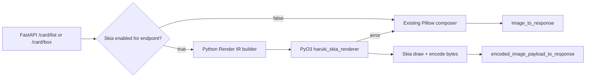

# Rust + Skia Render IR 迁移记录

本文档记录 Haruki Drawing API 将 Pillow 绘制热点逐步迁移到 Rust + Skia renderer 的目标、决策和进度。

> 二者的逐功能能力差距与剩余端点迁移前需补的缺口，见 [`skia-pillow-coverage-gaps.md`](./skia-pillow-coverage-gaps.md)。

## 目标

- 以 Card 模块为第一批迁移范围，尽可能减少 `/api/pjsk/card/*` 的 Pillow 热路径。
- 已用 `POST /api/pjsk/card/list` 验证 Python 构建 Render IR、Rust + `skia-safe` 负责绘制与编码的架构。
- 下一阶段优先迁移 `POST /api/pjsk/card/box`，并把 card full thumbnail 合成沉入 Rust 共享能力。
- 保留现有 Pillow 路径作为稳定回退，新增 Rust 路径默认关闭，通过配置灰度启用。

## 非目标

- 本阶段不同时迁移 `/api/pjsk/card/detail`、custom profile、MySekai 私有 drawer。
- `CardBoxRequest.user_info` 会先保留 Pillow 路径，避免本阶段同时迁移 profile card。
- 不追求与 Pillow 输出逐像素一致，只要求尺寸一致、主体布局和可读性一致。
- 不在 MVP 覆盖 emoji、复杂 font fallback、复杂文本排版和所有 Painter 操作。

## MVP 范围

- Python 侧继续负责请求模型、排序、时间判断、配置读取和 Render IR 构建。
- Rust 侧负责 Card List / Card Box 画布、背景、面板、卡牌缩略图子合成、图标、单行文本、水印和 PNG/JPEG 编码。
- 任意 Rust import、IR 校验、资产读取、Skia 渲染或编码错误都回退到 Pillow 路径。

## 架构图



## Render IR v1

顶层字段：

- `version`
- `assets_base_dir`
- `export_format`
- `jpg_quality`
- `timezone`
- `now_ms`
- `title`
- `background_img_path`
- `watermark`
- `fonts`
- `icons`
- `cards`

路径规则：

- 所有 asset path 必须是相对 `assets_base_dir` 的路径。
- 绝对路径、空 path、包含 `..` 或反斜杠的路径会被拒绝。
- Rust 侧会再次校验路径，Python 侧也会提前校验以便单测覆盖。

## Render IR v2 与通用解释器（大规模迁移基线）

为支撑把整个 `src/sekai/base` 绘制层（Painter / draw / plot）迁出 Pillow，第二阶段不再为每个端点写死 Rust 绘制函数，而是引入**声明式 Render IR v2 + 通用 Rust 解释器**。

设计约束（已与项目所有者确认，作为不可动摇前提）：

- **约束 A — 边界是声明式 IR，不是 Painter 类移植。** Python 构建 IR（一棵带类型的绘制节点树），Rust 是**通用解释器**（每种节点类型一个渲染器）。不把 Painter 的可变 region 栈 + 操作队列搬进 Rust；region/坐标模型变成 IR 结构（`Group` 节点带 offset + 可选 clip，子节点用相对坐标）。
- **约束 B — Skia 原生 AA/blur 即忠实基线，不追逐逐像素。** Pillow 与 Skia 是不同光栅器，逐像素一致不是目标、也不与忠实冲突。忠实 = IR 描述同一场景（几何、布局、颜色、圆角、模糊意图、文字位置、alpha 意图），Skia 用自身原生抗锯齿与原生 blur/image filter 渲染。**不复刻** Pillow 的超采样缩小抗锯齿、也不复刻精确高斯核；规格里的"超采样/重采样/模糊半径"被当作要在视觉上还原的意图，不是要照抄的实现步骤。

锁定的取舍：

- **布局归属** → 渐进式：解释器先行；Rust 暂留 card 网格布局并在内部 emit 节点树；之后逐端点把布局搬到 Python 的 `IRBuilder`，最终 Rust 收敛为纯解释器。
- **Emoji** → MVP 用 Skia 彩色 emoji 字体走文本整形，不移植 pilmoji 的 CDN+磁盘缓存管线。
- **TriangleBg RNG** → 确定性，按 `(宽, 高, 小时)` 播种（可被 composed image cache 命中）。
- **缓存** → 复用 configs 的 `IMAGE_CACHE_SIZE` / `THUMB_CACHE_SIZE` 预算，Rust 侧资产缓存用全局 LRU（键 `path,mtime,size,tw,th`）。
- **adaptive 文本** → MVP 只做平均亮度模式；逐像素 box-blur 阈值路径等确认有端点真用到再补。

IR v2 节点目录（`Group/Region`、`Rect`、`RoundRect`、`PieSlice`、`Image`、`Text`、`Gradient` fill、`BlurGlass`、`TriangleBg`、`Watermark`），顶层 envelope 复用 v1 的 `assets_base_dir` / `export_format` / `jpg_quality` 与路径安全规则，新增 `canvas{width,height}` 与扩展的 `fonts{dir,default,bold,heavy,emoji}`。

坐标 / region 语义：

- 节点坐标相对最近的外层 `Group`；解释器把所有坐标解析为**绝对坐标**后以单位矩阵绘制（不使用 canvas translate），从而让 `BlurGlass` 的 backdrop 快照与绘制坐标系天然一致。
- `Group.clip` 可选且显式（Painter 的 region 本身不裁剪），只有真正需要裁剪的节点才带 clip，通过 `canvas.save()/clip_rrect/restore()` 实现。

Rust 解释器骨架（本阶段新增，与既有 `render_card_list`/`render_card_box` 并存，复用其 infra：image 解码/缓存、`encode_surface`、字体加载、`SimpleRng`、`resolve_asset_path`、`draw_blur_glass_rect`、`draw_sekai_triangle_background`）：

- `ir.rs`：serde 节点 enum + Fill/Gradient/Color + 路径校验。
- `interp.rs`：`render_scene_inner(Scene)` dispatch + 绝对坐标 region 解析 + 各节点渲染器；新增 `render_scene(ir_json)` PyO3 入口。
- 后续按 `nodes/` 与 `support/` 进一步拆分。

移植顺序（按解锁端点数排序）：① Group + Rect/RoundRect → ② Image（最高频，改 NEAREST→cubic 采样 + fit 模式）→ ③ Text + FontRegistry → ④ Gradient + 渐变/adaptive 文本 → ⑤ BlurGlass → ⑥ 把 card_list/card_box 整体重建到解释器上 → ⑦ TriangleBg 对齐 → ⑧ Watermark → ⑨ PieSlice → ⑩ emoji + card detail 及之后。

对拍验证：逐节点 fixture，单节点同时走 Pillow 与 `render_scene` 渲染；尺寸硬断言（1px 偏差即失败），SSIM 按节点设阈值（文字≥0.95、形状≥0.98、玻璃≥0.90），失败输出 `expected|actual|diff` 三联图；TriangleBg 只做统计分布对比（RNG 不同，不做 SSIM）。

### v2 实施进度

- 通用解释器骨架：`ir.rs`（节点 enum）+ `interp.rs`（绝对坐标 region dispatch）+ `render_scene` PyO3 入口已落地。节点：`Group`、`Rect`、`RoundRect`（逐角半径）、`PieSlice`、`Image`（cubic 采样 + stretch/cover/contain/width）、`Text`（CjkTop / Ascender / Alphabetic baseline + 对齐）、`Shadow`、线性 `Gradient` fill、`BlurGlass`、`TriangleBg`、`ImageBg`、`Watermark`。radial 渐变、separate 方法、emoji fallback 为后续。
- ④ Card List / Card Box 已切到通用解释器（`card_scene.rs` 从 `CardListIr`/`CardBoxIr` 构建 v2 Scene），默认走解释器，`HARUKI_SKIA_CARD_LEGACY=1` 回退旧的写死绘制路径做 A/B。缩略图合成实现为分层节点子 `Group`（方案 1，无内存图句柄）；Card Box 的可变缩略图尺寸通过 build 时按比例缩放各图层坐标处理。
- 真实 12 卡 payload A/B：尺寸严格一致（Card List `1036x922`、Card Box `1316x368`），视觉与旧路径等价（cubic 采样更清晰、玻璃 backdrop 为实时快照，故非逐字节一致）。
- ⑥ 逐节点对拍 harness 已落地（`tests/test_skia_parity.py`）：单节点（或多节点,如 backdrop+glass）同时走 Pillow `Painter` 与 `render_scene`，尺寸硬断言 + 按节点选指标（填充 alpha-IoU / 文字 ink-bbox 容差 / 玻璃 MAE 上限），失败输出 `expected|actual|diff` 三联图到 `out/skia-parity/`。已覆盖 rect / roundrect / pieslice / 线性渐变 / CJK 文字 / **Image（stretch + width fit,IoU≈0.99）/ BlurGlass（实色背景上 MAE≈1.2,验证放置+tint+阴影）**。阈值按实测校准（如 rect IoU≥0.95、玻璃 MAE≤8）。Image 用例在缺少素材时自动跳过。`CjkTop` 现由 Python 使用 Pillow 字体度量解析成显式 alphabetic baseline，避免两个光栅器各自计算参考字高度造成整行漂移。
- ⑤ Python `IRBuilder`（`src/sekai/skia_renderer/ir_builder.py`，方法名沿用 Painter，发 v2 节点）已落地。**Card List 与 Card Box 布局都已从 Rust 搬到 Python**：`card_list.py` 的 `build_card_list_scene` 与 `card_box.py` 的 `build_card_box_scene`（含 `_build_box_groups` / `_compute_box_layout` 打包算法的 Python 移植），共享 helper 抽到 `card_common.py`；两个 `render_*_payload` 都改为构建 v2 scene 走 `render_scene` —— **Python 建 IR、Rust 纯解释**的终态在两个端点上都成立。
- A/B（真实 12 卡）：Card List 与 Rust 路径**逐字节一致**（`621539` bytes，`1036x922`）；Card Box 尺寸严格一致（`1316x368`，证明打包算法移植正确），像素仅 32/484288 处差 1 个通道 LSB（Python f64→JSON→serde f32 与 Rust 直接 f32 的表示噪声，视觉无差）。
- **Rust 收尾已完成**：两端点全走 Python scene 后,删除了 Rust 侧全部写死 card 代码 —— `card_scene.rs`、`render_card_list`/`render_card_box` 及其 `*_inner`、card draw 函数、`CardListIr`/`CardBoxIr` 等 IR 结构、`build_box_groups`/`compute_box_layout`、`HARUKI_SKIA_CARD_LEGACY` 旧路径。`lib.rs` 从 ~1970 行降到 739 行,PyO3 只暴露 `render_scene`;保留的共享渲染 helper(image 解码、`encode_surface`、`load_typeface`、`draw_blur_glass_rect`、三角形背景、`draw_cover_image`、`SimpleRng`)供 `interp` 复用。Rust 现已收敛为**纯 IR 解释器**。
- 待办：对拍再补对齐/裁剪变体与 cover/contain fit；补 radial/adaptive 文本；把 Card Box 布局从"抄旧 Pillow"重新定义为有意的布局(旧 Pillow box drawer 自身有容器/内容 2× 溢出 bug,不值得对齐);开 card list 灰度做真实验收;扩展到 card detail 等端点。

### 文字对齐与粗细校准（2026-07-13）

调查结论：字体文件和 role 映射没有错误，Pillow 与 Skia 均使用 `SourceHanSansSC-Regular/Bold/Heavy`。视觉差异来自两个独立来源：

- 位置：Pillow `Painter` 把逻辑 top 加上参考字 `哇` 的 Pillow ink height 得到 alphabetic baseline；旧 Skia 路径又用 Skia 的字形 bounds 重算一次，因此通用 IR 文字通常向下漂移 1-3px。Card List 的少量手写 baseline 则存在相反方向的 2-3px 偏移。
- 粗细：macOS 的 Skia/CoreText 与 Pillow/FreeType 对同一字体的抗锯齿覆盖率不同，Skia 默认平均约重 11%；Linux Skia/FreeType 默认平均约轻 12%。这不是切错 Bold/Regular，而是中间 alpha coverage 不同。

实施结果：

- `IRBuilder` 在 Python 侧用 Pillow 的字体度量把 `cjk_top` 统一解析为显式 alphabetic baseline；Rust 不再参与 Painter top 语义的布局计算。
- Card List 的标题、卡名、ID、未来卡提示和水印改用与 Pillow 相同的文字原点及 baseline 计算。
- Rust 显式设置 Skia font hinting，并只对单色文本 mask 做平台校准：macOS 使用 `Normal + gamma 4.0`，Linux 使用 `Slight + gamma 0.95`；彩色 emoji 绕过 gamma mask，保持原生 alpha。
- `HARUKI_SKIA_TEXT_HINTING` 与 `HARUKI_SKIA_TEXT_GAMMA` 可在进程启动前覆盖默认值，仅用于诊断和重新标定。

覆盖率基准以 Pillow 为 `1.0`：macOS 从 `1.113` 收敛到 `1.041`；Linux Docker/FreeType 从 `0.883` 收敛到 `1.012`。240 个文字节点的 macOS 微基准未观察到回归（gamma 关闭/开启中位数约 `0.0753s/0.0737s`）。

真实 payload 全图对拍（最终 release 扩展、默认配置的代表性单次运行；随机背景和预热状态会造成小幅波动，尺寸均一致）：

| Endpoint | 校准前 mean abs diff | 校准后 mean abs diff | Pillow | Skia |
| --- | ---: | ---: | ---: | ---: |
| Card Detail | `7.907` | `4.911` | `0.657s` | `0.399s` |
| Card List | `9.588` | `5.566` | `0.489s` | `0.165s` |
| Profile | `3.436` | `2.076` | `0.390s` | `0.223s` |

新增回归测试覆盖 Regular/Bold/Heavy、12-28px、Latin/CJK/混排；文字 ink bbox 顶边容差为 1px，coverage ratio 必须处于 `0.90-1.12`。剩余差异主要来自字形轮廓、背景随机三角形和图像采样，不再表现为整行文字基线漂移。

### 原始 asset 路径直传与 draw-time 缩放（2026-07-13）

调查确认：通用 Skia 路径在 `IRPainter.paste()` 阶段已经把源图和目标矩形直接写入 `Image` 节点，Rust 使用 Skia 的 `draw_image_rect` 在一次 draw 中完成缩放与合成，不会像 Pillow `resize()` 后再 `paste()` 那样产生一张中间尺寸的 raster。本次继续消除了原始 asset 的 RGBA 展开传输：

- `get_img_from_path()` 为未修改的返回图保留来源路径，并用 Pillow copy-on-write 状态判断像素是否仍与文件一致。
- `IRPainter` 仅在来源文件 canonical path 位于 `assets_base_dir` 内、且图像仍 pristine 时发相对路径；`copy/crop/resize`、原地修改、生成图以及根目录外图片继续发 `mem:*`，避免错误复用原文件。
- Rust 仍执行路径安全校验并通过进程级 image LRU 解码；Python 不再对这些节点调用 `tobytes()`，也不再跨 PyO3 传输整张 raw RGBA。
- `Image` 节点新增 `nearest`、`linear`、`cubic`、`linear_mipmap` 四种 sampling intent，默认保持原有 `linear_mipmap` 视觉；native `IR_CAPABILITY` 升到 `4`，旧 wheel 会 fail-open 回退 Pillow。

代表性真实 payload 的 IR 传输量（`mem_bytes` 为送入 native 的 raw pixel bytes）：

| Endpoint | Path nodes / image nodes | 优化前 mem bytes | 优化后 mem bytes | 降幅 |
| --- | ---: | ---: | ---: | ---: |
| Gacha Detail | `9 / 15` | `1,447,104` | `378,048` | `73.9%` |
| Music Detail | `11 / 11` | `2,989,632` | `0` | `100%` |
| MySekai Map | `66 / 111` | `7,598,608` | `5,777,168` | `24.0%` |
| Profile | `32 / 41` | `2,756,084` | `566,784` | `79.4%` |

同进程交替强制 path / mem 的 15 轮中位数分别为：Gacha `0.0490s / 0.0493s`、Music `0.0688s / 0.0701s`、MySekai Map `0.1152s / 0.1140s`、Profile `0.0844s / 0.0841s`。当前 wall time 基本持平，主要收益是减少 FFI 拷贝和瞬时内存；原因是 widget 构建仍会先通过 Pillow 加载原图，而 Rust 路径随后还需自行解码。要进一步消除这次重复解码，需要让 `ImageBox`/Canvas 接受 lazy `AssetRef`，在 Skia 路径完全跳过 Python image decode，这属于下一阶段的布局边界改造。

全量真实 payload sweep 为 `63 ok / 0 failed`，尺寸全部一致；结果和 SBS 写入 `out/parity-sweep-path-assets/`。代表场景 mean abs diff 为 Gacha Detail `5.098`、Music Detail `3.530`、MySekai Map `0.313`、Profile `2.415`，未观察到由路径直读造成的新色偏、裁剪或边缘回归。

### 目标栅格缓存、lazy asset 与 PNG 编码批次（2026-07-13）

本批次继续处理路径直传后仍存在的重复解码、冷启动串行缩放和 PNG encode 瓶颈：

- Rust 使用 Moka 建立按字节加权的进程级目标栅格缓存。key 包含 asset 的 canonical path / mtime / size、source rect、目标宽高和 sampling；默认预算 `256 MiB`，单项上限 `16 MiB`。可用 `HARUKI_SKIA_RASTER_CACHE_MB`、`HARUKI_SKIA_RASTER_CACHE_MAX_ENTRY_MB` 和 `HARUKI_SKIA_RASTER_CACHE_OVERSAMPLE` 调整。
- 原图通过 memory map 打开，按 `2x` 逐级降采样到实际绘制尺寸，仅保留最终 raster。首次 scene render 会在 Rayon 池中按 path / crop / target / sampling 去重并行预热；并发请求的同 key miss 由 Moka single-flight 合并。
- 新增 `renderer_cache_stats()` / `clear_renderer_caches()`，每次 native payload 也带 `native_metrics`，包含 setup、draw、encode、asset load、prewarm、cache hit/miss/coalesced、cache bytes 等分项。
- `music_list` 的 696 张 jacket 改用 header-only `AssetImageRef` 构建 Skia Canvas，Python 不再解码或缓存原图像素；缺图仍返回原有 Pillow 占位图，Pillow composer 与 fail-open 回退路径不变。该能力目前是高基数端点试点，尚未对所有 widget builder 全局启用。
- `BlurGlass.blur <= 0.01` 跳过 backdrop snapshot 和临时 blur surface；PyO3 输入直接构造 Skia `Data`，输出允许直接持有 Skia `Data` 或 Rust `Vec<u8>`，减少中间复制。
- PNG 默认改用 `mtpng 0.4.1` 的多线程 fast compression；`HARUKI_SKIA_PNG_ENCODER=skia` 可即时回退原 Skia encoder。PNG 仍无损，代表场景文件大小变化约 `-2%` 到 `+6%`。

`music_list` 同进程 696 asset 基准：旧路径首次约 `6.17s`、后续约 `1.51-1.62s`，RSS 最终约 `2.0 GiB`；新路径首次约 `1.63s`、后续约 `0.62-0.64s`，Python image cache 约 `0.1 MiB`，Rust 696 项目标栅格约 `11.4 MiB`，进程 RSS 约 `0.30 GiB`。最终全量 sweep 的冷态结果为 Pillow `2.939s`、Skia `1.207s`（`2.44x`）。

PNG encoder A/B（Skia level 3 / `mtpng` fast）：Chart `109.5ms -> 37.7ms`、Event Detail `86.7ms -> 14.8ms`、Music List `186.2ms -> 61.3ms`、MySekai Map `79.8ms -> 18.7ms`、MySekai Map Multi `200.5ms -> 42.4ms`。最终 `63/63` 真实 payload 尺寸与视觉对拍通过；代表运行中 62 个端点不慢于 Pillow，仅 `sk_winrate` 的 `scale=2x` 小图路径为 `0.78x`，下一批应处理 scene scale 直渲染而非 render 后整图 resize。

## 进度表

| 阶段 | 状态 | 记录 |
| --- | --- | --- |
| 迁移文档 | Done | 本文档建立目标、范围、IR 和验收记录位置。 |
| Python 配置与桥接 | Done | 已新增配置、IR builder、fallback 接入。 |
| Rust PyO3 crate | Done | 已新增 `rust/haruki_skia_renderer` 并通过 PyO3 暴露 `render_card_list`。 |
| Card List MVP | Done | 已实现 3 列列表布局、图标、文本、水印和 card_full_thumbnail 子合成。 |
| Card List 基线固化 | Done | 12 卡约 `0.076s vs 0.190s`；真实 60 卡约 `0.294s vs 0.780s`；主要瓶颈为 PNG encode。 |
| 共享缩略图能力 | Done | Card Box 复用 Rust `compose_thumbnail`，后续 Card Detail 可继续沿用该子合成路径。 |
| Card Box 迁移 | Done | 已新增 `render_card_box`、Python IR builder 和 `/card/box` fallback 接入；先覆盖无 `user_info` 的收集册主体网格。 |
| 原始 asset 路径直传 | Done | Pristine asset 以安全相对路径进入 Rust；缩放与合成一次 draw 完成，生成图/修改图自动保留 `mem:*`。 |
| Rust 目标栅格缓存 | Done | Moka 字节预算缓存、mtime/size 失效、逐级降采样、Rayon scene 预热与 native metrics 已落地。 |
| Lazy AssetRef | In Progress | `music_list` 已跳过 696 张 jacket 的 Python 解码；其余 builder 按端点收益逐步接入。 |
| 多线程 PNG 编码 | Done | 默认 `mtpng` fast，保留 `HARUKI_SKIA_PNG_ENCODER=skia` 回退；代表场景 encode 提升约 `2.9-5.9x`。 |
| Card Detail 迁移 | Pending | 等 Card Box 验收后复用共享缩略图、图标、面板和文本能力推进。 |
| Payload 构建工具 | Done | 已新增 `scripts/build_card_list_payload.py`，可从 `haruki-sekai-master` 生成 Card List payload。 |
| 资产同步工具 | Done | 已新增 `scripts/sync_card_list_assets.py`，可从主云 Tailscale SSH 按 payload 拉取最小资产集。 |
| 测试与基准 | Done | 编译、单测、真实 payload 对比和 blur+edge 视觉补强基准已通过。 |

## Payload 构建

真实 Card List payload 可由 Team-Haruki masterdata 构建：

```bash
git clone --depth=1 https://github.com/Team-Haruki/haruki-sekai-master.git out/haruki-sekai-master

uv run python scripts/build_card_list_payload.py \
  --master-dir out/haruki-sekai-master/master \
  --region jp \
  --card-id 1 \
  --card-id 2 \
  --title smoke \
  --output out/card-list-payload.json
```

该脚本参考 cloud 侧 `internal/pjsk/render/card` builder，只覆盖 Card List MVP 所需字段：

- card basic：ID、角色、unit、release、supply type、rarity、attribute、prefix、asset bundle、power。
- skill：技能 ID、名称、类型、基础描述、`static_images/skill_*.png`。
- thumbnail：`asset/{region}-assets/startapp/thumbnail/chara/*`、frame、attribute、rare star、birthday icon。
- top-level icons：`static_images/card/term_limited.png`、`static_images/card/fes_limited.png`。
- supply type 会按 cloud 侧规则归一化；`world_bloom` 且 `unit=none` 的 event card 会把 `term_limited` 映射为 `WL限定`。

## 资产同步

真实 Card List 视觉验收需要与 cloud 侧 builder 产物使用同一批素材。主云可通过 Tailscale IP SSH 访问：

- SSH：`root@100.111.213.59`
- 默认 Drawing 远端根目录：`/data/HarukiServices/data/drawing`
- 默认游戏资产远端根目录：`/data/HarukiServices/data/assets`
- 本地默认根目录：`data`

同步一份 `/api/pjsk/card/list` payload 所需的最小素材集：

```bash
uv run python scripts/sync_card_list_assets.py \
  --payload-file out/card-list-payload.json \
  --dry-run

uv run python scripts/sync_card_list_assets.py \
  --payload-file out/card-list-payload.json
```

脚本会读取这些字段并生成 `rsync --files-from` 清单：

- 顶层：`background_img_path`、`term_limited_icon_path`、`fes_limited_icon_path`
- 卡牌技能：`skill.skill_type_icon_path`、`special_skill_info.skill_type_icon_path`
- 缩略图：`card_thumbnail_path`、`frame_img_path`、`attr_img_path`、`rare_img_path`、`train_rank_img_path`、`birthday_icon_path`
- 字体：默认包含 `SourceHanSansSC-*` 与 `TwitterColorEmoji-SVGinOT.ttf`，可用 `--no-include-fonts` 关闭

同步路由：

- `static_images/*` 与字体从 Drawing 远端根目录同步到本地 `data/`。
- `asset/*` 会去掉远端侧 `asset/` 前缀，从游戏资产远端根目录同步到本地 `data/asset/`。

路径安全规则与 IR v1 一致：拒绝绝对路径、反斜杠、换行和 `..`。

## 性能基线

2026-06-23 真实 Card List payload 对比：

- Payload：`out/rust-skia-card-list-test/card-list-compare-payload.json`
- Cards：`1,2,3,4,109,110,180,181,195,196,295,335`
- 素材：通过 `scripts/sync_card_list_assets.py` 从主云 Tailscale SSH 实际同步 43 个路径。
- 输出：
  - Pillow：`out/rust-skia-card-list-test/card-list-pillow.png`
  - Skia：`out/rust-skia-card-list-test/card-list-skia.png`
  - 并排检查图：`out/rust-skia-card-list-test/card-list-side-by-side.png`
  - 指标：`out/rust-skia-card-list-test/card-list-compare-metrics.json`

| Backend | Build | Size | Bytes | Draw/render+encode | Encode | Result |
| --- | --- | --- | ---: | ---: | ---: | --- |
| Pillow | CPython 3.14t | `1036x922` | `655847` | `0.232s` | `0.031s` | Baseline |
| Skia | Rust release + per-render asset cache + warmed | `1036x922` | `498423` | `0.075s` | `0.034s` | 通过 |

结论：

- 尺寸硬指标通过：Pillow 与 Skia 均为 `1036x922`。
- 视觉人工检查通过 MVP 要求：主体布局、卡面、限定标识、技能图标、文本位置可接受；已补充 Skia 侧玻璃面板的柔阴影、高光描边和边缘层次。背景、字体栅格化和采样风格与 Pillow 不逐像素一致。
- 性能目标通过：预热后的 Skia 路径 `0.075s`，Pillow 路径 `0.232s`，绘制+编码耗时下降约 `67.7%`。
- 首轮误判记录：刚 rebuild/reinstall PyO3 扩展后的首轮 wall time 曾达到约 `0.58s`，但 Rust 内部 profile 显示实际 render+encode 约 `0.08-0.12s`；该差异来自动态库/线程池/首次调用预热噪声，不作为 steady-state 性能结论。
- 低风险优化：Rust 单次 render 内增加 asset decode cache，避免重复解码同一批 frame、rare、attr、skill icon。
- 视觉补强：Rust 侧已将 glass rect pass 改为局部背景快照裁剪 + Skia blur image filter + 半透明填充 + 暗色外描边 + 内侧高光。相比轻量版更接近 Pillow 的 `blurglass_roundrect`，代价是 steady-state render+encode 从约 `0.075s` 上升到约 `0.118s`。

2026-06-23 blur+edge 视觉补强后，使用同一 payload、清除 composed image cache 但保留热 asset cache 的 cache miss 对比：

| Backend | Build | Size | Bytes | Draw/render+encode | Result |
| --- | --- | --- | ---: | ---: | --- |
| Pillow | CPython 3.14t + uncached composed image | `1036x922` | `663359` | `0.184s` | Baseline |
| Skia | Rust release + local backdrop blur + edge strokes | `1036x922` | `526030` | `0.118s` | 通过 |

结论：blur+edge 版仍达到性能目标，较 Pillow cache miss 下降约 `35.8%`。profile 见 `out/rust-skia-card-list-test/skia-profile-blur-edge-miss.log`，并排图见 `out/rust-skia-card-list-test/card-list-side-by-side.png`。

2026-06-23 背景进一步对齐：

- Python IR 新增 `background_hour`，按 Pillow 侧 `datetime.now()` / `HARUKI_BG_TEST_HOUR` 计算，让 Rust 与 Pillow 使用同一时间色板。
- Rust 默认背景从简化圆形装饰改为复刻 `RandomTriangleBg(True)` 的粉蓝渐变、白色柔化层、边缘三角形密度和透明度规则。
- 三角形位置不追求逐像素一致：Pillow 使用全局随机数，Rust 使用本地确定性 RNG，目标是整体观感一致和可复现。
- 固定 `HARUKI_BG_TEST_HOUR=15.5` 后的 cache miss 对比：Skia `0.157s` vs Pillow `0.218s`，耗时下降约 `27.8%`。
- 并排图仍输出到 `out/rust-skia-card-list-test/card-list-side-by-side.png`，profile 见 `out/rust-skia-card-list-test/skia-profile-bg-align.log`。
- badge 与底部边缘修正：限定 badge 改为按宽度等比绘制，匹配 Pillow `ImageBox(size=(75, None))`；卡片玻璃层降低内侧白边、加强下方柔阴影，使底部卡片边缘更接近 Pillow 的外侧阴影质感。
- skill 图标修正：Rust 从右上角改为卡片右下角 8px inset，匹配 Pillow `Frame().set_content_align("rb")` 的布局。
- 字体缓存优化：Rust 侧增加进程内 `FontSet` cache，避免每次 render 重复读取并解析同一组字体。预热后 `load_fonts` 从约 `25-40ms` 降至接近 `0ms`。
- 固定 `HARUKI_BG_TEST_HOUR=15.5`、8 轮 cache miss 对比：Skia `0.100s` vs Pillow `0.182s`，耗时下降约 `45.2%`。profile 见 `out/rust-skia-card-list-test/skia-profile-font-cache.log`。
- 降采样 blur 优化：玻璃层背景从全尺寸 blur 改为 2x 降采样后 blur 再放大，贴近 Pillow 的降采样 blur 策略。`draw_grid_panel` 从约 `18ms` 降至约 `8ms`，`draw_cards` 从约 `27ms` 降至约 `17ms`。
- 固定 `HARUKI_BG_TEST_HOUR=15.5`、8 轮 cache miss 对比：Skia `0.076s` vs Pillow `0.190s`，耗时下降约 `59.8%`。profile 见 `out/rust-skia-card-list-test/skia-profile-downsample-blur.log`。
- 真实 60 卡基准：通过公网 `root@yamamoto.j8.network:60022` 同步 card 1355-1414 所需素材。固定 `HARUKI_BG_TEST_HOUR=15.5`、6 轮 cache miss 对比：Skia `0.294s` vs Pillow `0.780s`，耗时下降约 `62.2%`，尺寸均为 `1036x4090`。profile 见 `out/rust-skia-card-list-test/skia-profile-60-real.log`。

2026-06-23 Card Box 初版接入：

- 新增配置：`drawing.use_skia_card_box=false`、`drawing.skia_card_fallback_to_pillow=true`。
- 新增 Python 桥接：Card Box Render IR builder、native payload wrapper、fallback 记录。
- `/api/pjsk/card/box` 已接入 Skia 优先路径；成功时直接返回 `EncodedImagePayload`，失败时回退 `compose_box_image()`。
- `CardBoxRequest.user_info` 暂不走 Skia，主动回退 Pillow，避免本阶段同时迁移 profile card。
- Rust 新增 `render_card_box(ir_json: bytes) -> dict`，返回字段与 `render_card_list` 一致。
- Rust Card Box 已覆盖：背景、提示条、玻璃面板、角色分组、角色色条、角色图标、卡面缩略图、限定 badge、ID 文本、水印、PNG/JPEG 编码。
- Native smoke：基于现有 60 卡 Card List payload 派生 Card Box IR，`HARUKI_SKIA_PROFILE=1` 输出 `2718x594` PNG，total `0.209s`，encode `0.093s`，draw_cards `0.034s`，compose_thumbnails `0.020s`。
- 派生 payload 不是 cloud 侧真实 Card Box builder 输出；尝试用该 payload 运行 Pillow 对照时触发现有 Pillow 布局宽度断言，因此本次不记录为正式性能验收。
- 正式 Card Box 性能和视觉验收待从 cloud 侧导出真实 `/card/box` payload 后补充。

Rust profile 样例，见 `out/rust-skia-card-list-test/skia-profile.log`：

- total：`0.110s`
- load_fonts：`0.051s`
- encode：`0.032s`
- draw_cards：`0.017s`
- compose_thumbnails：`0.013s`
- load_images：`0.009s`
- image cache：`39` misses、`59` hits

可继续优化的真实瓶颈是字体加载与 PNG encode；卡片布局和 thumbnail 合成本身不是主要耗时。

## 风险

- Skia 与 Pillow 的抗锯齿、缩放采样、透明混合和圆角边缘不完全一致。
- 字体解析和 CJK 文本布局是主要视觉风险；emoji 与复杂 fallback 暂不作为 MVP 必达。
- `skia-safe` 会增加构建时间和依赖体积，CI 需要单独观察。
- Rust 路径默认关闭，且保留回退，以降低上线风险。

## 验收记录

2026-07-13 Rust 性能批次（目标栅格 cache / lazy asset / parallel prewarm / `mtpng`）：

- `uv run ruff check src/ tests/`：通过。
- `uv run pytest -q`：172 passed。
- `cargo fmt --check`、`cargo clippy --all-targets -- -D warnings`：通过；`cargo test`：12 passed（含半透明 RGBA 的 `mtpng` 无损 round-trip）。
- `uv run maturin develop --release --manifest-path rust/haruki_skia_renderer/Cargo.toml`：通过，CPython 3.14t release 扩展已重建。
- 最终全量真实 payload sweep：63/63 `ok`、0 failure、尺寸全部一致；结果与 SBS 位于 `out/parity-sweep-raster-cache-mtpng/`。
- `music_list` 最终 mean abs diff `3.134`，保持在路径直传前后的视觉波动范围；目标缓存的逐级降采样避免了单步 740 -> 64 带来的锐化/混叠回归。
- 结论：图片解码/缩放和 PNG encode 两类通用 Rust 瓶颈已完成第一轮治理；下一优先项为 `Scene.scale` 直渲染，以及评估其余高基数列表是否接入 lazy `AssetImageRef`。

2026-07-13 原始 asset 路径直传与 sampling：

- `uv run ruff check src/ tests/`：通过。
- `uv run pytest -q`：170 passed；其中 45 个相关测试覆盖 pristine/modified provenance、根目录约束、path render、mem fallback 和 sampling IR。
- `cargo fmt --check`、`cargo clippy --all-targets -- -D warnings`：通过；`cargo test`：8 passed。
- `uv run maturin develop --release --manifest-path rust/haruki_skia_renderer/Cargo.toml`：通过，release 扩展报告 `IR_CAPABILITY=4`。
- 全量真实 payload sweep：63/63 `ok`、0 failure，尺寸全部一致；输出见 `out/parity-sweep-path-assets/`。
- 结论：原始 asset raw pixel 传输显著下降，热态绘制耗时总体中性；后续性能工作应转向 lazy `AssetRef` 和 PNG encode，而不是重复优化已融合的 resize + paste。

2026-07-13 文字对齐与粗细校准：

- `uv run ruff check src/ tests/`：通过；`uv run ruff format --check src/ tests/`：129 files already formatted。
- `uv run pytest -q`：167 passed；其中字体回归覆盖 Regular/Bold/Heavy、不同字号与 Latin/CJK/混排。
- `cargo fmt --check --manifest-path rust/haruki_skia_renderer/Cargo.toml`：通过。
- `cargo clippy --manifest-path rust/haruki_skia_renderer/Cargo.toml --all-targets -- -D warnings`：通过。
- `cargo test --manifest-path rust/haruki_skia_renderer/Cargo.toml`：7 passed。
- `uv run maturin develop --release --manifest-path rust/haruki_skia_renderer/Cargo.toml`：通过，重新安装最终 CPython 3.14t release 扩展。
- 真实 payload sweep：Card Detail、Card List、Profile 均为 `ok` 且尺寸一致；结果写入临时验收目录 `/tmp/skia-text-final-rebuilt`。

2026-06-23 初版实现记录：

- `uv run ruff check src/ tests/test_skia_card_list.py tests/test_settings.py`：通过。
- `uv run pytest tests/test_skia_card_list.py tests/test_settings.py`：11 passed。
- `cargo fmt --manifest-path rust/haruki_skia_renderer/Cargo.toml --check`：通过。
- `cargo clippy --manifest-path rust/haruki_skia_renderer/Cargo.toml --all-targets -- -D warnings`：通过。
- `cargo test --manifest-path rust/haruki_skia_renderer/Cargo.toml`：3 passed。
- `uv run maturin develop --manifest-path rust/haruki_skia_renderer/Cargo.toml`：通过，生成 CPython 3.14t wheel。
- Native empty Card List smoke：通过，输出 `image/png 1036x262`，PNG signature 正确。
- free-threaded 兼容：PyO3 模块已声明 `gil_used = false`，复测 import/render 无 GIL warning。
- `uv run maturin develop --release --manifest-path rust/haruki_skia_renderer/Cargo.toml`：通过，生成 release 扩展用于真实对比。
- 资产同步工具：
  - `uv run ruff check src/ scripts/build_card_list_payload.py scripts/sync_card_list_assets.py tests/test_build_card_list_payload.py tests/test_sync_card_list_assets.py tests/test_skia_card_list.py tests/test_settings.py`：通过。
  - `uv run pytest tests/test_build_card_list_payload.py tests/test_sync_card_list_assets.py tests/test_skia_card_list.py tests/test_settings.py`：24 passed。
  - `uv run python scripts/sync_card_list_assets.py --payload-file <tmp> --list-only --no-include-fonts`：通过，输出 payload 所需素材清单。
  - `uv run python scripts/sync_card_list_assets.py --payload-file <tmp-empty> --dry-run`：通过，Tailscale SSH + rsync dry-run 退出码为 0。
  - `git clone --depth=1 https://github.com/Team-Haruki/haruki-sekai-master.git <tmp>` + `scripts/build_card_list_payload.py` + `scripts/sync_card_list_assets.py --dry-run`：通过，真实 masterdata card 1/2 payload 的 Tailscale rsync dry-run 退出码为 0。
- 真实 Card List payload 对比：
  - `scripts/build_card_list_payload.py`：通过，生成 12 卡 payload。
  - `scripts/sync_card_list_assets.py`：通过，从主云实际同步 43 个素材路径。
  - 尺寸验收：通过，Pillow 与 Skia 均为 `1036x922`。
  - 视觉验收：人工检查通过 MVP 要求，但存在预期的背景、阴影、字体和采样差异。
  - 性能验收：通过，Skia `0.075s` vs Pillow `0.232s`，耗时下降约 `67.7%`。
  - Profile：`HARUKI_SKIA_PROFILE=1` 输出已保存到 `out/rust-skia-card-list-test/skia-profile.log`。
- blur+edge 视觉补强：
  - Rust：新增局部 backdrop blur、暗色外描边、内侧高光与更明确的接触阴影。
  - `cargo fmt --manifest-path rust/haruki_skia_renderer/Cargo.toml --check`：通过。
  - `cargo test --manifest-path rust/haruki_skia_renderer/Cargo.toml`：3 passed。
  - `cargo clippy --manifest-path rust/haruki_skia_renderer/Cargo.toml --all-targets -- -D warnings`：通过。
  - `uv run maturin develop --release --manifest-path rust/haruki_skia_renderer/Cargo.toml`：通过。
  - cache miss 对比：Skia `0.118s` vs Pillow `0.184s`，耗时下降约 `35.8%`。
- 背景对齐：
  - Rust：默认背景改为粉蓝渐变 + 随机三角形风格，IR 增加 `background_hour`。
  - 固定 `HARUKI_BG_TEST_HOUR=15.5` cache miss 对比：Skia `0.157s` vs Pillow `0.218s`，耗时下降约 `27.8%`。
- badge/edge 修正：
  - Rust：限定 badge 改为等比缩放；卡片边缘调低硬白线并增加底部柔阴影。
  - 固定 `HARUKI_BG_TEST_HOUR=15.5` cache miss 对比：Skia `0.129s` vs Pillow `0.181s`，耗时下降约 `28.5%`。
- skill 图标修正：
  - Rust：技能图标位置改为卡片右下角 8px inset，与 Pillow `rb` 对齐方式一致。
- 字体缓存优化：
  - Rust：新增进程内字体缓存，避免每次渲染重复 `FontMgr::new_from_data`。
  - 固定 `HARUKI_BG_TEST_HOUR=15.5` cache miss 对比：Skia `0.100s` vs Pillow `0.182s`，耗时下降约 `45.2%`。
- 降采样 blur 优化：
  - Rust：玻璃层背景改为 2x 降采样 blur 后回贴，降低大面板和卡片 blur 开销。
  - 固定 `HARUKI_BG_TEST_HOUR=15.5` cache miss 对比：Skia `0.076s` vs Pillow `0.190s`，耗时下降约 `59.8%`。
- 真实 60 卡基准：
  - 公网同步：`scripts/sync_card_list_assets.py --ssh-host root@yamamoto.j8.network --ssh-port 60022` 成功。
  - Payload：`out/rust-skia-card-list-test/card-list-60-payload.json`，card 1355-1414。
  - 尺寸验收：通过，Pillow 与 Skia 均为 `1036x4090`。
  - 性能验收：通过，Skia `0.294s` vs Pillow `0.780s`，耗时下降约 `62.2%`。
- Card Box 初版：
  - `uv run ruff check src/ tests/`：通过。
  - `uv run pytest tests/test_skia_card_list.py tests/test_skia_card_box.py tests/test_settings.py`：16 passed。
  - `cargo fmt --check --manifest-path rust/haruki_skia_renderer/Cargo.toml`：通过。
  - `cargo clippy --manifest-path rust/haruki_skia_renderer/Cargo.toml --all-targets -- -D warnings`：通过。
  - `cargo test --manifest-path rust/haruki_skia_renderer/Cargo.toml`：3 passed。
  - `uv run maturin develop --release --manifest-path rust/haruki_skia_renderer/Cargo.toml`：通过。
  - Native empty Card Box smoke：通过，输出 `image/png 560x238`，PNG signature 正确。
  - Native 60 卡派生 Card Box smoke：通过，输出 `image/png 2718x594`，profile total `0.209s`，encode `0.093s`。

待补充：

- 从 cloud 侧导出真实 Card Box payload，并补充 Pillow vs Skia 正式视觉/性能验收。
- 是否将字体/typeface 缓存提升到跨请求级别。
- 是否调优 PNG encode，或在 JPG 输出场景单独做基准。
- 是否需要把背景三角形 RNG 种子从确定性改为请求级随机，以更贴近 Pillow 的每次渲染变化。
